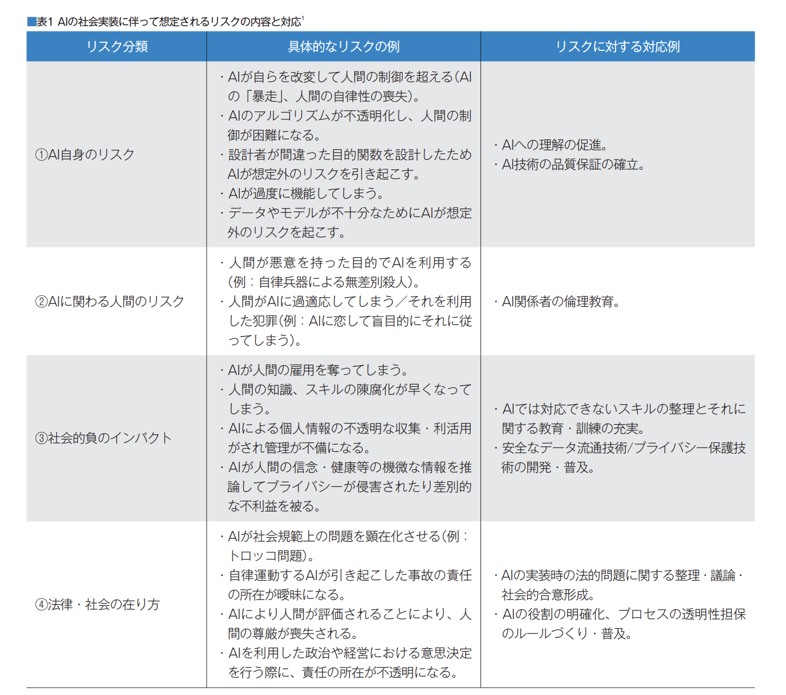

# 1.1 人工知能の定義

## 人工知能とは何か

コンピュータを使って、学習・推論・判断など人間の知能のはたらきを人工的に実現したもの。

人工知能とは「計算機により知的な情報処理システムの設計や実現」

### 人工知能における研究課題

人間が自然に行っている学習能力と同様の機能をコンピュータで実現しようとする技術・手法

## AI効果

人工知能で何か新しいことが実現され、その原理が分かってしまうと、「それは単純な自動化であって知能とは関係ない」と結論付ける人間の心理的な効果

## 人工知能とロボットの違い

- ロボット：あらかじめプログラムされた動作を正確に行う。自己判断で進めることはできない。
  - 人間で例えると「体」
- 人工知能：自立して発展していく。自ら学習して精度を高めることができる仕組み。
  - 人間で例えると「脳」

## エージェント

- 事前に定義された目標を達成するためのコードまたはメカニズム
- 「チャットボット」「ソフトウェア」など

## 古典的な人工知能

- 将棋のプログラムや掃除ロボット、あるいは質問に答える人工知能
- 入力と出力を関係づける方法が洗練されており、入力と出力の組み合わせの数が極端に多いもの

## 機械学習

- 経験からの学習により自動で改善するコンピューターアルゴリズムもしくはその研究領域
- アーサーサミュエル：明示的にプログラムしなくても学習する能力をコンピュータに与える研究分野

## ディープラーニング

- ディープニューラルネットワークを用いて学習を行うアルゴリズム

# 1.2 人工知能研究の歴史

## ダートマス会議

- 1956年に開催された、人工知能という学術研究分野を確立した会議の通称である。
- ジョン・マッカーシーが主催。
- 初めて人工知能という言葉が誕生

## 人工知能研究のブームと冬の時代

- 社会がAIに期待することと、実際にできることの乖離が大きく、
- 実用化できなくなってしまう。

## エニアック（ ENIAC ）

- アメリカのペンシルベニア大学で製作された世界初の汎用コンピュータ。電子計算機と名付けられた。
- エレクトロニクスの高速性と複雑な問題を解くために、プログラミング可能な能力を初めて併せ持った計算機。
- 第二次世界大戦中、敵の暗号を解読するために作られた。

### エニグマ（ENIGMA）

- ナチス・ドイツがエニアックと同じ時期に開発した暗号機の名前

### エドサック（EDSAC）

- 初期のイギリスのコンピュータ。これが現代のコンピュータの基礎になる。

## ロジック・セオリスト

- 人間の問題解決能力を真似するよう意図的に設計された世界初のプログラム。
- 「世界初の人工知能プログラム」と称された。

## 人工知能の分類方法

### レベル１：シンプルな制御工学

- 一般的な電化製品に搭載されている、すべての振る舞いが決められたもの

### レベル２：古典的な人工知能

- 掃除ロボなど。探索・推論・知識データを利用

### レベル３：機械学習を取り入れた人工知能

- 機械学習を使って、入力出力を学習。
- 交通渋滞の予測など。

### レベル４：ディープラーニングを取り入れた人工知能

- 特にディープラーニングをつかって、音声認識・画像認識・機械翻訳などをすること。

## トイ・プロブレム

- 簡単なゲームのような問題のこと。
- 迷路やオセロのようにルールとゴールが決まっている問題をAIで解くことであり、そのような世界観の問題しか解けないことを指す。第1次AIブームで用いられた。

## エキスパートシステム

- 初心者でも専門家と同じレベルの問題解決が可能となるよう、その領域の専門知識をもとに動作するコンピュータシステム。第2次AIブームで用いられた。

## 第五世代コンピュータ

- 人工知能コンピュータの開発を目標にした、通商産業省所管の新世代コンピュータ技術開発機構が、1982年から1992年にかけて進めた国家プロジェクトの計画名称.

## ビッグデータ

- ビッグデータ とは、一般的なデータ管理・処理ソフトウエアで扱うことが困難なほど巨大で複雑なデータの集合

### IBM社の４つのV

- Volume
- Value
- Variety
- Velocity

## 特徴量

- 分析すべきデータや対象物の特徴・特性を、定量的に表した数値

## 推論・探索の時代

- 第1次AIブームのこと
  - 1950年代後半から1960年代

## 知識の時代

- 第2次AIブームのこと
  - 1980年代〜

## 機械学習と特徴表現学習の時代

- 第3次AIブームのこと
  - 2000年代〜

## ディープブルー(DeepBlue/Deep Blue)

- IBMが開発したチェス専用のスーパーコンピュータ。
- 1996年には世界チャンピオンを破った。
- 機械学習ではなく、「力任せの探索」。
- 対局相手の出しそうな手をすべて洗い出した。

### Tay（テイ）

- マイクロソフト社が開発下会話ロボット。
- 2016年似Twitterのボットとして公開されたが、複数のユーザによって、
- 会話能力が不適切に訓練されたため、間違った方向のコメントをするようになってしまった。
- 今は停止。

# 2.1 探索・推論

## ハノイの塔

- 1つの棒に通された数枚の円盤を、定められたルールに従って、他方の棒に移動するパズル

## コスト

- 自分がどの程度有利なのかを定量的に表す。
- ボードゲームで効率的に勝てる手を考える時に使う。
- コストを考えることで、無駄な探索を早めに打ちきることができる。
- スコアとも言いかえられる。

## モンテカルロ法

- 確率変数のサンプリングをコンピューターを用いて行うことで、
- 数学的問題を（主として数理統計学における意味で）数値的に解く手法
- ゲームがある局面まで進んだら、予め決められた方法でゲームの局面のスコアを評価するという方法を完全に放棄する。
- その代わりに、コンピュータが２人の仮想的なプレイヤーを演じ、完全にランダムに手を指し続け、シミュレーションをし、とにかく終局（プレイアウト）させる。
- 数を多く打って、最良のものを選ぶ。

## 探索木

- 計算機科学において特定のキーを特定するために使用される木構造

## 幅優先探索

- 始点となるノードから隣接するノードを探索し、
- さらに隣接するノードに対して探索を繰り返して目的のノードを探す。
- 最初はどの動作の順序が正解かわからないため、同時に複数の道筋を記憶しておく必要がある。記憶容量が多くなりやすい。

## 深さ優先探索

- アルゴリズムは根から始まり、バックトラックするまで可能な限り探索を行う。
- 「縦型探索」とも呼ばれる。
- 一度一方向に最後まで探索し、間違えていたら分岐点まで戻る。
- 前の状態に戻るのに手間がかかるため、深い場所にある場合、幅優先だと途中で記憶容量がパンクする可能性があるため、ステップ数が多い場合は深さ優先！

## プランニング

- 探索により、ロボットの行動計画を作成すること

## STRIPS(Stanford Research Institute Problem Solver)

- 「前提条件」、「行動」、「結果」の３つの組み合わせで自動計画を記述するプランニングの手法。
- 命令を簡単な処理に切り分ける「自動計画」のために開発。
- リチャード・ファイクスとニルス・ニルソンによって開発された。

## SHRDLU

- 1968年から1970年にかけて、テリー・ウィノグラードによって実施された
- 人工知能研究初期の研究開発プロジェクト。
- 端末の画面の中の小さな「積み木の世界」に存在する物体を動かすことで完全に自動計画を実現しようとする研究もあった。
- 実際に命令に従うことができた。
- このように、人間と対話する人工知能（AI）プログラム。

## AlphaGo(アルファ碁）

- Google DeepMindによって開発されたコンピュータ囲碁プログラム
- 2015年10月に、人間のプロ囲碁棋士を破った
- 教師ありフェーズと強化学習フェーズの二段階で強さを高める。

### Ponanza

- 将棋のAI
- 佐藤天彦名人が敗北。

### 教師あり学習フェーズ

**SL Policy**
人間の棋譜を教師データとし、ある盤面を見て次の盤面を予測。

**Rollout Policy**
現在の盤面から次の盤面を予測。
予測性能を下げる代わりに計算を高速化

### 強化学習フェーズ

**RL Policy**

- SLPolicy同士を戦わせ、勝ったほうが取った手を方策勾配法で強化する。
- これを繰り返す。

**Value Network**

- RL Policy同士で戦わせる。
- 入力は現在の盤面状態で、出力が入力盤面の勝敗、教師データはRLPolicyで作成した棋譜。

## AlphaFold

- DeepMindがつくった。
- AIを使ってタンパク質の構造を見出し新薬開発に活かす。
- CASP13コンテスト優勝。

## ヒューリスティック

- 経験則や勘に基づいて答えを導き出す発見的問題解決手法
- 探索に利用する経験的な知識を「ヒューリスティックな知識」という。

## Mini-Max法

- 想定される最大の損害が最小になるように決断を行う戦略
- 自分が指す時にスコアが最大になるように手を打つ。相手が指すときには自分のスコアが最小になる選択をすると考える

## αβ法

- 基本的にミニマックス法(Mini-Max法)と同じであり、同じ計算結果が得られるが、
- ゲーム木において、計算しなくても同じ計算結果になる部分を枝刈りする。
- αカット：最小のスコアを選ぶ際、既に出現したスコアより大きいノードを弾く。
- βカット：最大のスコアを選ぶ際、既に出現したスコアより小さいノードを弾く。
- 非常にわかりやすくまとまっているサイト
<https://pictblog.com/gmini-max>

## ブルートフォース

- 総当たり攻撃。可能な組合せを全て試すやり方。
- モンテカルロ法もブルートフォース法といえる。
- 9×9の以後ではプロ棋士と同等になったが、19×19では刃が立たなかった。
- 勝利したAlphaGoはディープラーニングを使って勝利することに。

# 2.2 知識表現

## 人工無能

- 人間的な会話の成立を目指した人工知能に類するコンピュータプログラム
- いわゆるチャットボットのような、データベースから問い合わせに対する回答をマッチさせる仕組み。
- 予め決められたルールによって会話するため、オウム返しの返答が多いが、人間と会話している感覚になる。

## 知識獲得のボトルネック（エキスパートシステムの限界）

- シンボルグラウンディング問題とフレーム問題のように、
- 実世界の意味と結びつけられなかったり、
- 関係ある知識だけを選び出すことが難しいという困難さのこと

## 意味ネットワーク

人間の記憶の一種である意味記憶の構造を表すためのモデル.
知識を線で結び、その関係性を表したもの。
現在でもAIプロダクトの解釈性を高めるために使われる。
有向グラフまたは無向グラフなど。

## オントロジー

知識・情報を構造化し整理するモデルのこと。
「物事の存在」について考え、概念を体系化する学問のこと。
トム・グルーパーが、「概念化の明示的な仕様」と定義している。
ヘビーウェイトオントロジー：哲学的な知識
ライトウェイトオントロジー：効率重視な知識

オントロジーの目的は、効率よく知識を共有・活用すること。
そのために必要な約束ごとがオントロジー。
オントロジーがあれば、色んな人が知識を表現する場合も記述レベルや語彙によって左右されることなく、知識をつなげて利用することが可能。
Cycプロジェクトは一般常識をデータベース化するPJ。今も続いてる。

## 概念間の関係（is-a と part-of の関係）

is-a：継承関係。哺乳類-犬みたいな
part-of：上下関係。車-部品みたいな

## 東ロボくん

「ロボットは東大に入れるか」において研究・開発が進められている人工知能。
国立情報学研究所が2011年から研究している。
質問の意味や意思を理解しているわけでは無いが、MARCHレベルは合格できる。

## ワトソン君（Watoson）

IBMが開発した質問応答システム・意思決定支援システム
2006年に開発を開始。
IBMでは、人工知能ではなく、人間の補佐をする「拡張知能」と呼ぶ。
第二次 AI ブームの時代においては,知識応用の研究が盛りを見せた.中でも 2011 年に IBM が開発した人工知能
アメリカのクイズ番組「ジョパティ！」に出演し,歴代のチャンピオンを破ったことは人々に大きな衝撃を与えたことだろう.

## イライザ（ ELIZA )

1964年にジョゼフ・ワイゼンバウムによって開発されたコンピュータプログラム。
相手の発言から、事前に登録したパターンと比較し、返答するチャットボット
人工無能の代表として、出題される。

### 　A.L.I.C.E

イライザに触発されて開発されたもの。
その年、最も人間に近いと判定されたものに授与されるローブナー賞の銅賞を３回受賞。

## イライザ効果

コンピュータのことを、自分とコミュニケーションがとれる人間だと誤認してしまうこと。

## 知能の全体像

第一の階層＝パターン処理
身体性が必要

第二の層＝記号の処理
チェスなどを楽しむ

第三の階層＝他者とのインタラクション

## エキスパートシステムの歴史

### マイシン（ MYCIN ）

血液中のバクテリアの診断支援をするルールベースのプログラム
エキスパートシステムの一種。
1970年代にスタンフォード大学で開発された。
感染した細菌に合った抗生物質を処方することができる。
専門医ではない医師よりは良い結果を出した。

### DENDRAL

1960年代の人工知能プロジェクト
未知の有機化合物を質量分析法で分析し、有機化学の知識を使って特定する
エドワード・ファイゲンバウムにより、スタンフォード大学で開発された。
1970~1980年代荷渡、多くのエキスパートシステムが作られる。

## インタビューシステム

専門家が持つ知識を、上手にヒアリングするシステムのこと

## has-aの関係

あるオブジェクトが他のオブジェクトを所有している場合に成立する関係
~を含む、のような包括関係。

## Cycプロジェクト

一般常識をデータベース化し（知識ベース）、人間と同等の
推論システムを構築することを目的とするプロジェクト
知識ベースは汎用的な単一のナレッジベースとしてまとめることは難しいため、一般的には特定分野に絞って構成される。

推移律
集合の二つの要素間の関係に関する条件の一つ。
集合の二要素 x、y の間に関係 R があることを xRy と書くことにしたとき、
「xRy かつ yRz なる限り常に xRz」が成立するならば、
関係 R は推移律を満たす。

ウェブマイニング
ウェブサイトの構造やウェブ上のデータを利用して行うデータマイニングのこと

データマイニング
統計学、パターン認識、人工知能等のデータ解析の技法を
大量のデータに網羅的に適用することで、
有用な知識を取り出す技術のこと。

Question-Answering
質問応答システムのこと。
自然言語の質問をユーザから自然言語で受けつけ、
その解答を返すようなコンピュータソフトウェア

セマンティックWeb
Webページに記述された内容について、
「情報についての情報」（いわゆるメタデータ）を一定の規則に従って付加し、
コンピュータシステムによる自律的な情報の収集や加工を可能にすること

## 機械学習・深層学習
ニューラルネットワーク
機械学習の一つで、人間の神経回路をマネすることで
学習を実現しようとするもの。

レコメンデーションエンジン
一般的には対象者の何らかのアクションに対して、
判断し予測するステップを経てコンテンツをリアルタイムに提示する。
Amazonとかで、おススメがでてきたりするアレ

## スパムフィルター
スパムメール（迷惑メール）であるかどうかを判定する仕組み

## 統計的自然言語処理
複数の単語をひとまとまりにした単位で用意された
膨大な量の対訳データをもとに、「最も正解である
確率が高い訳」を選択。
（従来は文法構造や意味構造を分析している。）

## コーパス
対訳データのこと。自然言語処理の研究に用いるため、
自然言語の文章を構造化し大規模に集積したデータベースのこと。

## コサイン類似度
2つのベクトル間の類似度の指標で、-1～1の範囲をとる
2つのベクトルが「どのくらい似ているか」という類似性を表す尺度で、具体的には2つのベクトルがなす角のコサイン値のこと。1なら「似ている」を、-1なら「似ていない」を意味する。
主に文書同士の類似性を評価するために使われている。
類似度を計算するときは、「特定の文書にのみ頻繁に出現する単語」と、「どの文章にでもだいたい出現する単語」とで異なる重みを計算するほうが良さそう。この時に、単語の重要度を計算する手法の一つが「TF-IDF」。

## 単純パーセプトロン
ニューラルネットワークの元祖。1958年に、
フランク・ローゼンブラットが考案した。
入力層と出力層のみを持つ。

## 線形分離可能

単純パーセプトロン：線形分離可能な問題を解ける
多層パーセプトロン：線形分離不可能な問題も解ける

## 誤差逆伝播法
1986年に命名された、ニューラルネットワークを
学習させる際に用いられるアルゴリズム。
累計された誤差の値が小さくなるように、
枝の重みを右から左に順番に更新すること。

## 自己符号化器(オートエンコーダ)
入力データと一致するデータを出力することを目的とする教師なし学習。
入力したデータの次元数をいったん下げ、再び戻して出力する。
これもトロント大のジェフリー・ヒントンが提唱
不良品が少ない現場においてもオートエンコーダは教師データの準備コストを抑えた上で異常検知できる。
オートエンコーダにノイズのあるデータを入力し、ノイズのないデータを正解データとして教師あり学習をさせると、学習後にデータを入力するとノイズが無いデータが得られる。
オートエンコーダを使うと画像データの場合は入力された画像の特徴を捉えた別の新しい画像を生成できる。
オートエンコーダは得量ごとにクラスタリングできる。

## 　ILSVRC
2010年から始まった大規模画像認識の競技会。
2012年、トロント大のジェフリーヒントン率いるSuperVisionがAlexNetでディープラーニングを
用いて優勝。これを受けて、第3次ブームに発展。
2012年以降のチャンピョンはみんなディープラーニングを使って優勝。

- ILSVRC2012
  - ジェフリーヒントン率いるチーム(SuperVision)がAlexNet(8層)で圧倒的な成績を残す
  - SVM（サポートベクターマシン）を中心とした技術が中心であった大会をCNN中心に置き換えたきっかけになった
  - 活性化関数はReLUが導入された、Dropout技術が用いられた
- ILSVRC2013
  - NY大学のZFNetが優勝
    - ZeilerとFerbusのイニシャルから取っている
    - AlexNetの問題点を明確化し改良したCNN
- ILSVRC2014
  - GoogleNet(22層)が優勝
  - Inception moduleやGlobal Average Poolingという技術も導入
- ILSVRC2015
  - ResNet(152層)が優勝
  - Microsoft
  - 初めて人間のエラー率5%を上回る精度を達成した記念すべき年
  - バッチ正則化を本格的に導入して精度を上げたモデル
  - ResNet以降、バッチ正則化が標準的に組み込まれるようになった
- ILSVRC2016
  - 優勝は香港中文大学の CUImage
  - CU は Chinese University of Hong-Kong の CU をとっているものと思われる
  - 原論文は "Crafting GBD-Net for Object Detection" です。こちらは既存技術の組み合わせ、つまりアンサンブル技術が中心となっており技術的に注目すべき点はないと言われています。
- ILSVRC 2017
  - ILSVRC の最終年の優勝は中国科学アカデミーの SENet です。原論文は " Squeeze-and-Excitation Networks " です。
  - SENet の SE は Squeeze-and-Excitation からとっているものと思われます。このモデルで特徴的なのはSqueeze and Excitation Module というモジュールを既存関数に挿入することで精度をあげていることです。詳細は原論文を参照してください。

## 　ISI
上記の大会で２位だった東大の機械。
10%以上も離された。

## 　次元の呪い
データの次元数が大きくなり過ぎると、
そのデータで表現できる組み合わせが飛躍的に多くなってしまい、
手元にあるサンプルデータでは十分な学習結果が得られなくなること

## 　パターン認識

画像や音声など膨大なデータから一定の特徴や規則性のパターンを識別して取り出す処理のこと

## 　特徴抽出

- 画像の関心部分をコンパクトな特徴ベクトルとして効率的に表現する、一種の次元削減

## OCR(Optical Character Recognition/Reader)

手書きや印刷された文字を、スキャナによって読みとり、
コンピュータが利用できるデジタルの文字コードに変換する技術

# 　2.3 人工知能における問題
## 　フレーム問題
有限の情報処理能力しかないロボットには、
現実に起こりうる問題全てに対処することができないことを示すもの
1969年にジョン・マッカーシーが提唱。

## 　チューリングテスト
アラン・チューリングが提案した、ある機械が「人間的」かどうかを判定するためのテスト

## 　強いAIと弱いAI

- 強いAI(汎用型AI)：人間の知能に近い機能を人工的に実現するAI。SFによく出るやつ
  - フレーム問題を打破しているもの

- 弱いAI(特化型AI)：人間の知能の一部に特化した機能を実現するAI。社会に適用しているよくあるAI。
  - フレーム問題を打破していないもの

## 　シンボルグラウンディング問題

- 記号で指し示されるものをAIがどのように認識するかという問題
- 記号システム内のシンボルがどのように実世界の意味と結びつけられるか

## 身体性

人間の経験や体験に基づくもの。

## 　シンギュラリティ
AIが人類の知能を超える転換点（技術的特異点）
それにより人間の生活に大きな変化が起こるという概念

- レイ・カーツワイル
  - 「シンギュラリティは2045年に到来する」

- ヒューゴ・デ・ガリス
  - 「シンギュラリティは21世紀後半に到来する」

- イーロン・マスク
  - シンギュラリティに危機感を持ち、非営利組織OpenAIを設立

- オレン・エツィオーニ
  - 「シンギュラリティは100万年後に特異点を迎える可能性はある。
  - しかし、世界制覇すると言う構想は馬鹿げている。」

- ヴィーナー・ヴィンジ
  - 「機械が人間の役に立つふりをしなくなる」

- スティーブン・ホーキング
  - 「AIの完成は人類の終焉を意味するかもしれない」

## ローブナーコンテスト

1991年から開催されている
チューリングテストに合格する会話ソフトウェアを目指すコンテスト

## 中国語の部屋

ジョン・サールが発表した。
中国語を理解できない人を小部屋に閉じ込めて、マニュアルに従った作業をさせる思考実験。
チューリングテストが無意味である証明につながる。

## ルールベース機械翻訳(RBMT)

1970年代。登録済みのルールを適応することで原文を分析し、訳文を出力する機械翻訳の方法。
人手では限界があり、うまく行かなかった、

## 統計学的機械翻訳(SMT)

1990年代。統計学や確率論に基づく機械翻訳の方法。
ある言語とその対訳を学習させてモデルにする。
学習させるため、人手の問題が解消されたが、実用的ではなかった。

## ニューラル機械翻訳（NMT）

2014年。ニューラルネットワークの活用により、格段に精度がUP。
データが溜まるほど、精度が高くなるので、現在ではこの手法が主流。
統計学的機械翻訳と合わせてコーパスベース方式と呼ばれることもある。（コーパス＝対訳）

## 特徴表現学習

画像・音声・自然言語から特徴表現を自動的に抽出する学習のこと
特徴量の加工や抽出まで学習器が行うこと。
ディープラーニングは特徴量学習を行う手法。

# 3.1 代表的な手法

## 教師あり学習

正解データを適切に予測できるよう、正解データとそのほかの変数のセットの関数を学習する枠組み。
正解データは目的変数、その他の説明変数と呼ぶ。

## 教師なし学習

正解を参照せず、変数同士の構造やパターンを抽出する。

## 強化学習
将来の報酬を最大化するように、特定の状況下における行動を学習する。
一連の行動による報酬和が最大の時、方策は最適

# 3.2 教師あり学習

## 線形回帰(LinearRegression)

説明変数と目的変数の関係に「直線や（超）平面」を当てはめ、予測・説明する手法。
要は、データの分布があったとき、そのデータに最も当てはまる直線を考えるというもの。
説明変数を用いた一次関数で、目的変数を求める手法とも言える。回帰問題で使う。
正規加項を加えた手法として、**ラッソ回帰**と、**リッジ回帰**が存在する。
ｙは-∞〜∞をとる。

### 統計的仮説検定

観測された標本を用いて、その母集団の性質を判断する手続きのこと。
ある特定の確率分布を帰無仮説（棄却されるべき仮説）として仮定し、
その分布にデータが従っていないかを判断する。

### 　最小二乗法
各データの点を通るそれっぽい直線を数学的に引くこと。
距離を図りたいので、マイナス・プラスを加味しないために、二乗する。

### 　多重共線性
説明変数どうしの相関が高すぎると、単独の影響を分離したり、
その効果を評価するのが難しくなる問題。
ある説明変数をその他の説明変数で回帰するモデルを推定し、相関係数が高くなりすぎないようにすることで
防ぐ。

## 　ロジスティック回帰

分類問題に用いる手法。
シグモイド関数を用いて、閾値で正例(+1)と負例(0)を分類する。
3種類以上の分類は、ソフトマックス関数を使う。
線形回帰を拡張した一般化線形モデルに含まれる。（線形回帰のy=0,1バージョン）

※一般化線形モデルとは、y=f(β1x1 + β2x2 + …)と表せる説明変数の線形結合のこと。

- 1. 対数オッズと呼ばれる値を重回帰分析により予測する
- 2. 対数オッズをロジスティック関数（シグモイド関数）で予測することでクラスiに属する確率piを求める
- 3. 各クラスに属する確率を計算し、最大確立を実現するクラスが、データが属するクラスと予測する

ロジスティック回帰は,ある事象の分類を 0 ～ 1 の値の確率として表現することができる.
このロジスティック回帰を行う際には,（ア：4.　最尤推定） が用いられ,最も確からしいパラメータを獲得することを目的としている.
このロジスティック回帰を用いるのに適切な事例としては,
（イ）3.　喫煙状況や血中のコレステロール値などをもとに病気の発症リスクについて調べる
などが挙げられる.

ロジスティック回帰の学習には最尤推定が用いられる.最尤推定を行うことで最も確からしいパラメータを獲得することができる.

ロジスティック回帰は2値分類に適している

### ベータ回帰

目的変数が0<y<1の連続値である場合の一般化線形モデル。

### オッズ

事象が起きる確率を起こらない確率で割った値、

## KLダイバージェンス

2つの確率分布がどの程度似ているかを表す尺度。
2つの確率分布が同じ場合、値は0となる
2つの確率分布が同じ場合、値は0となる

### ロジットリンク変換
オッズの対数を取る変換のこと。
ロジットはオッズの対数をとったもの。
オッズの対数をとったもののことを対数オッズといい、
対数オッズを関数とみなしたものをロジット関数といいます。
ロジット関数は本質的にオッズを表していると考えるとわかりやすいです。

実はオッズの対数を取ることによって尺度の問題を解決することができます。
この変換をロジットリンク変換と呼ぶ。

>①自分のチームが非常に弱い時
自分のチームが非常に弱い時、オッズはどんどん0に近づいていることがわかります。
逆に数式的に0よりマイナスにはならないこともわかるかと思います。

>・1勝8敗の時
(1/9)/(1−1/9)=0.125

>・1勝16敗の時
(1/17)/(1−1/17)=0.062

>②自分のチームが非常に強い時
自分のチームが非常に強い時、逆にオッズは1から無限に大きくなることがわかります。

>・8勝1敗の時
(8/9)/(1−8/9)=8

>・16勝1敗の時
(16/17)/(1−16/17)=16

>上記2つの例を見ると、自分のチームが弱い時のオッズは0から1に間に収まっているのに対して
強い時のオッズは1から∞と、尺度が合っていて単純に比較できないことがわかります。

## 決定木

分類問題を解くアルゴリズムの一つとして,ある変数について条件分岐を行いそれを繰り返すことによってそれを解く （ア：3.　決定木） がある.
（ア：3.　決定木） を行う際には,あまりに瑣末な分類を行なって汎化性能を損なわないように,
条件分岐の回数の初期値を設定することでそれを適切な回数に留める.なおこの手法を,（イ：剪定）と呼ぶ.

- 決定木はとてもシンプルなアルゴリズムなので
  - 実装が簡単や学習が高速
  - モデルの説明が簡単といった利点がある.
  - **ただし柔軟で細かな分類は苦手といった欠点がある.**

決定木は,木が枝分かれをするように（ア）の繰り返しによって表されるモデルを学習によって得る手法である.（ア：条件分岐）のしかたの基準となるのは（イ：1.　情報利得の最大化）である.
決定木は SVM やニューラルネットワークなどの手法と比較して（ウ：分析結果を説明しやすいこと）や（エ：データの前処理が少なくすむ）という特徴があり,実務でも好んで利用される手法である.

## ランダムフォレスト

ざっくり、「バギング」＋「決定木」を用いる手法。
ブートストラップサンプリングを用いて学習。
複数の決定木の結果から、多数決で出力を決定。
過学習を起こしやすいという弱点を克服

## ブースティング

一部のデータを繰り返し抽出して、複数のモデルを学習させる。
バギングと違い、逐次的に学習させる。
AdaBoost、XGBoost、勾配ブースティングがある。
学習データに対して何度も学習させるため、弱学習器の数が多すぎると学習回数が増え、過学習を起こす可能性が高まる。

- ブースティングはアンサンブル学習の一つで,弱い分類器を何度も学習させることにより性能を高めることである

## サポートベクターマシン(SVM)

各データ点との距離が最大となるような境界線を求めることで、
パターン分類を行う。距離を最大化することを、マージン最大化と言う。
カーネル関数を用いて計算を行うが、計算量が非常に大きくなるため、
カーネルトリックと言う手法を用いて、計算量を抑えることができる。
一部の誤分類を寛容にするため使用される変数をスラック変数という。
カーネル法は決定境界を非線形にする

エンジニアが事前に調整するパラメータ：ハイパーパラメータ

## 自己回帰モデル(AR)

ある時刻 t の値を、​時刻 t よりも古いデータを使って回帰するモデル。
今日までの我が身の生き方から明日の我が身を占う。

## ARIMA

自己回帰和分移動平均モデル。

## 分類問題

データをそれぞれカテゴリに分類する手法

## 回帰問題

学習時に入力データと出力データから対応する規則を学び、
未知の入力データに対して適切な出力結果を生成する手法

## 半教師あり学習

少量の教師データ（ラベル付きデータ）を用いることで、
大量のラベル無しデータを、より簡単に学習させることができるモデル

## ラッソ回帰(LASSO)

変数選択と正則化の両方を実行し、生成する統計モデルの予測精度と
解釈可能性を向上させる回帰分析手法
リッジ回帰と違って不要と判断される説明変数の係数（重み）が0になる性質があり、つまりモデル構築においていくつかの特徴量（説明変数）が完全に無視される。

### スパースデータ

要素に０が多くなるようなデータ。
このようなデータは線形回帰やロジスティック回帰が使えない事が多い。
回帰係数を０にして、モデルに寄与する変数を選択するために、ラッソ回帰を使う。

## リッジ回帰(Ridge)

過学習を防ぐため線形回帰に正則化項(ペナルティ項)として、
L2ノルムを導入したモデル。
正則化された線形回帰の一つで、線形回帰に「学習した重みの二乗（L2正則化項）」を加えたもの。
重みは完全に０にはならない性質があるため、説明変数が非常に多い時にはモデルの解釈が複雑になるという欠点がある。

## アンサンブル学習

単独では強い手法ではない手法を複数使って精度を上げる方法

## バギング

全体の一部のデータを用いて、複数の手法で並行して学習するモデル

- 複数のモデルをそれぞれ別に学習させ,各モデルの出力を平均もしくは多数決することで決める手法のこと
- バギングはアンサンブル学習の一つで,複数のモデルを別々に学習させ,各モデルの平均や多数決によって最終的な判断をする手法である.

## 勾配ブースティング木

「勾配降下法＋アンサンブル学習＋決定木」の3つの手法が組み合わせた機械学習の手法。
特にテーブルデータで使う。
代表的なライブラリはxgboot,lightgbm,catboostなど。

## ブートスラップサンプリング

母集団となるデータがあるときに、
母集団から重複を許してランダムにいくらかデータを取り出して再標本化をする手法

## ベイズの定理

P(B|A)  の逆確率である P(A|B) は、「P(B|A) と P(A) の積を P(B) で割る」ことで求められる。

事象Aを原因、事象Bを結果とすると、P(A|B)は結果がわかっている元での原因の確率。（事後確率）
P(A)は事象B（結果）がわかる前のAの確率。（事前確率）
P(B|A)は結果に対する原因のもっともらしさを表す。（尤度）（ゆうどと読む）
想定するパラメータが具体的な数値を取る場合に、観測されたデータが起こり得る確率のこと。

### ベイズ推定

観測事象から推定したい事柄を確率的に推論すること

## 最尤推定（さいゆうすいてい）

尤度が最も大きくなるように推定すること。

# 3.5 評価指標（回帰）

## RMSE

回帰問題での代表的な評価指標
二乗誤差の平均の平方根をとる。
そのため、より大きな誤差を重視する傾向にある。

## MSE

誤差の絶対値の平均を取る。
そのため、目的変数の外れ値にあまり影響されたくない場合につかう。
RMSEはMSEの平方根

## RMSLE(二乗平均平方根対数誤差)

目的変数と予測値の比に着目する評価指標である。

## 決定係数

回帰問題によって求められた予測値や当てはめの値が、正解ラベルとどの程度一致しているかを表す指標。
回帰によって導いたモデルの当てはまりの良さを表現する値で、
モデルによって予測した値が実際の値とどの程度一致しているかを表現する評価指標。
０〜１の範囲を取る。
値が大きいほどモデルが適切にデータを表現できている（線を引けている）ことを意味。

## 機械学習の前処理

- 欠損値の処理・補完
- 名寄せ
- 正規化（データをスケーリングする）、標準化（平均を０、分散を１に変換）
- 時系列データの時間粒度の変更
- 画像データのサイズ統一化、グレースケール化
- テキストデータの分かち書き、不要文字の削除、半角全角の統一

## 基礎集計

機械学習の前処理より前の工程

- 各種代表値を計算
- 散布図行列をプロットして傾向をしらべる
- 相関行列を表示し、傾向を調べる

## 特徴量エンジニアリング

モデルが認識しやすい特徴をデータから作ること

- カテゴリカル変数を「カテゴリカル変数である」とわかる形に変換する
- one-hot-encoding: たった一つの成分だけを１、他を０にする
- 日付データの変換
- 多項式特徴量を生成

重回帰分析を行う際は「多重共線性」の検出も重要

# 3.5 評価指標（分類）

## 混同行列

予測値と実測値のマトリックスのこと。
評価を明確にしたいときに用いる。
これを使って、正解率などを出す。

### 正解率（Accuracy）

全予測正答率
TP + TN / TP + FP + FN + TN

### 適合率（Precision）

陽と判断し、本当に陽だった割合
疾患ありと判断した人のうち、本当に疾患ありだった割合
正予測の正答率
TP / TP + FP

- レコメンド機能

### 再現率（Recall）

答えのうち、正しく判定できた割合
疾患を有する人のうち、疾患ありと判断された割合
TP / TP + FN

- 疾病判定

### 特異率（Specificity）

負に対する正答率
TN / FP + TN

### F値（F-measure）

適合率と再現率の調和平均
2 × Precision × Recall / Precision + Recall

## logloss

分類問題の評価指標。
0~1の連続値を予測値とするモデルの評価に使用される。

例）サンプルが正例である確率は0.3、負例である確率は0.7

loglossの代表例としてAUCなどがある。
自信を持って回答した答えが誤っている時に値が大きくなる。

## ROC曲線

真陽性率や真陰性率を組み合わせて作成した曲線

### 　AUC（Area Under Curve）
ROC 曲線下の面積（積分）
ROC曲線が直線なら、0.5
大きくなると１に近づく。

## 　多層パーセプトロン

単純パーセプトロンの層を増やしたモデル
入力層・中間層・出力層に分かれている。

ベクトル自己回帰モデル（VARモデル））
時間の経過とともに変化する複数の量の間の関係を
キャプチャするために使用される統計モデル

隠れ層
入力層と出力層の間の層（中間層）の別称

疑似相関
2つの事象に因果関係がないのに、
見えない要因によって因果関係があるかのように推測されること

## 重回帰分析

回帰分析において独立変数が2つ以上のもの。
相関が強い2つ以上の説明変数を採用すると、予測精度が悪化する。
これを**多重共線性(MultiCpllonearity)**と呼ぶ。

AdaBoost
ブースティングの手法の一つ
弱い識別機を組みわせて、強い識別機を作成する手法

重回帰分析において,学習させて作成したモデルがどのくらい精度の良いものなのかを評価する際には幾つかの方法がある.
そのうち数値によってそれを確認する代表的な手法の一つは （ア：4.　決定係数） を用いるもので,0 から 1 の間の値を取り,1 に近いほどモデルがデータに対して当てはまりが良いことを示す.
数値を利用するその他の手法としては, （イ：RMSE） が挙げられる.これは,作成したモデルによって導かれる予測値が実際の値よりどれだけずれているかという誤差の二乗の平均の平方根を求めたものである.

RMSEは平均二乗誤差の平方根のことであり,予測した数値と実際の数値がどれだけずれているかを測る指標である.回帰分析のモデルの評価として使用される.

# 教師なし学習

- 教師なし学習＝データの本質的な構造を浮かび上がらせる

- クラスタリング：k-means法
  - データの本質的な構造を浮かび上がらせる
    - 注意：
      - 教師あり学習の「クラス分類」と
      - 教師なし学習の「クラスタリング」は別もの
        - クラス分類：エンジニアがあらかじめ設定した「クラス」にデータを分類する
        - クラスタリング：似たデータがなすクラスタを抽出する
- 次元削減：
  - データの情報を失わないようにデータを低い次元に圧縮する手法の総称

## k-means法

非階層型クラスタリングのアルゴリズム。
クラスタの平均を用いて、与えられたクラスタ数をk個に分類する

## ウォード法

クラスター間の距離を定義する距離関数のひとつ
集合PとQがあるとき、
d = E – E(P) – E(Q) で定義されるdを、
PとQの距離とする。

## 主成分分析（PCA）

データの特徴量間の送還を分析することで、
データの構造をつかむ手法
寄与率を見ると、重要性がわかる。
主成分を見ると、意味を推測できる。

いかに少ない変数で説明力の高いモデルを作るかを考える上で有用な機械学習アルゴリズムの一つとして,（ア：4.　主成分分析（PCA）） がある.
これは,複数の観測変数をそれぞれに適切な重み付けをした上で束ね,一つの説明力の高い変数として潜在変数を作りあげるものである.
またこのように説明変数の数を減らすことを,（イ：次元削減） と呼ぶ.

＞本質的な項目２つ取り出して次元削減を行う 話が出てきたら主成分分析

## 協調フィルタリング

利用者の閲覧履歴等を収集して、推論して提案する仕組み
「ほかのユーザーはこんな記事も読んでいます。」的な

## 内容ベースフィルタリング

あるユーザーが購⼊した商品のタグ情報から、類似の商品を探し推薦する方式

## トピックモデル

自然言語処理の分野で用いられる統計的潜在意味解析の一つで
「言葉の意味」を統計的に解析していく手法

文章中に書かれている話題・テーマを抽出するための手法として,（ア：3.　トピックモデル）が利用されている.
代表的な手法として,テキストデータに特異値分解を適用した潜在意味解析 (LSI) や,その後に開発され,ディリクレ分布という確率分布を利用した（イ：LDA）が知られている.

### LSI（Large Scale Integration）

日本語では潜在的意味解析と呼ばれ、非常に端的にこの技術をまとめると、「自動車」「車」等、
同じ意味をもつ単語をうまくグルーピングして、文章中の情報量を凝縮して、要点を強めようという圧縮技術

### LDA（Latent Dirichlet Allocation）

潜在的ディレクトリ配分法。
文章中の潜在的なトピックを推定し、文章分類や、文章ベクトルの次元削減等に用いられる技術。

## クラスタリング

データ間の類似度にもとづいて、​データをグループ分けする
教師なし学習の一手法

## クラスタ分析

異なる性質のものが混ざり合った集団から、
互いに似た性質を持つものを集め、クラスターを作る

## レコメンデーション

過去のお客様の購買履歴をもとに好みを分析し、
そのお客様の興味・関心がありそうな情報を提示すること

## デンドログラム（樹形図）

クラスター分析において、
逐次的に標本がグループ化される様子を木の枝のような線で表したもの

## 特異値分解

線形代数学において、
複素数あるいは実数を成分とする行列に対する、行列分解の一手法

## 多次元尺度構成法

分類対象物の関係を、低次元空間における点の布置で表現する手法
例えば、xy軸を取って、複数のデータを点で表し、関係性を見る

## t-SNE

高次元データを2次元や3次元に落とし込むための次元削減アルゴリズム
ジェフリー・ヒントンが考えた。
t分布
コールドスタート問題
新規ユーザー・新規アイテムが増えた際に、
評価データが集まるまでレコメンデーションが出来ない問題

コンテンツベースフィルタリング
アイテムの特徴をもとにユーザが過去に高評価したアイテムと
似た特徴を持つアイテムをレコメンドする手法

## 潜在的ディリクレ配分法（LDA)

データの一部が類似しているデータを複数のグループに分類する。

## 次元削減・次元圧縮

データの次元数を減らすこと。多次元からなる情報を
その意味をまた持ったまま低次元に落とし込むこと

# 強化学習

## バンディットアルゴリズム

実データに基いてWebサイトなどの改善を行う手法の総称。
活用と、探索の2つから構成される。

## マルコフ決定過程モデル

状態遷移が確率的に生じる動的システムの確率モデルであり、
状態遷移がマルコフ性を満たすもの。
S：状態の集合,A：行動の集合,P：遷移確率,R：報酬で構成される。

## 価値関数

横軸に人間が感じる損失や利得の程度
縦軸に価値の大きさをそれぞれ設定して、グラフ化したもの
グラフの中心には、参照点が置かれる。

## 方策勾配法

方策をあるパラメータで表される関数とし、
そのパラメタを学習することで、直接方策を学習していくアプローチ
方策反復法の1つの手法である

## 割引率
価値関数で用いる、各ステップの報酬を割り引くためのファクター
強化学習では、報酬は未来に行くほど小さい

## ε-greedy方策
Q値の大きい行動を優先する手法。
Q値は、ある場面において次にとるべき行動を選択するための指標

## UCB方策

探索と活用のバランスをとりながらアームの選択を行い、
報酬の最大化を目指す手法。
UCBは、Upper Confidence Boundの略。

## マルコフ性

確率論における確率過程が持つ特性の一種。
その過程の将来状態の条件付き確率分布が、現在状態のみに依存し、
過去のいかなる状態にも依存しない特性を持つこと。
「過去の状態が与えられたとき、現在の状態は条件付き独立」である。

## 状態価値関数

直近の報酬に1ステップ先の価値関数を足したもの
前提として、方策および遷移確率で未来のとりうる値は枝分かれするので、
その期待値をとる

## 行動価値関数

状態sでの行動aを評価する関数。
とある状態sが与えられたとき、どの行動が最適なものかを導く手法

## 価値反復法

行動価値と状態価値の2種類の価値を定義する
TD誤差が可能な限り小さくなるまで学習を行う
Sarsaはアルゴリズムの代表例の1つである

### Sarsa

Q学習では次の行動をQ値の更新後似決定するのに対し、行動をQ値の更新前に決定する手法

## Q値

ある場面において次にとるべき行動を選択するための指標

## Q学習

エージェントが行動するたびにQ値を更新する学習法
機械学習手法の方策オフ型強化学習の一つ。

## REINFORCE

自分で生成したサンプルを擬似的な教師データとして、評価が高いサンプルに高い重みをつけて学習する操作。
一連の行動による報酬和で方策を評価して直接方策を改善する。
正式名称はREward Increment = Nonnegative Factor times Offset Reinforcement times Characteristic Eligibility
方策勾配法ベースの具体的な手法の一つ。
AlphaGoにも利用されている。

## Actor-Critic

行動を選択肢するアクターと、アクターが選択した行動を評価する。
クリティックで構成される強化学習のフレームワークの1つ
行動を決めるActor（行動器）と方策を評価するCritic（評価器）から成り立つ。
行動を選択する側と行動を評価する側で構成されるValueベースとPolicyベースを組みわわせた手法である。

## A3C（Asynchronous Advantage Actor-Critic）

エイスリーシーと呼ぶ。
特徴は、AsynchronousかつAdvantageを使って学習させる点。
GPUではなく、CPUで計算可能。DQNより性能がいい。
Actor-Criticを利用している。

## 混同行列

予測値と実測値のマトリックスのこと。
評価を明確にしたいときに用いる。
これを使って、正解率などを出す。

分類問題における適切な性能指標
これを利用することで、正答率だけでなく精度や再現率を図る事ができる

### 正解率（Accuracy）
全予測正答率
TP + TN / TP + FP + FN + TN

### 適合率（Precision）
正予測の正答率
TP / TP + FP

### 再現率（Recall）
生に対する正答率
TP / TP + FN

### 特異率（Specificity）
負に対する正答率
TN / FP + TN

### F値（F-measure）

適合率と再現率の調和平均
2 × Precision × Recall / Precision + Recall

## ROC曲線

真陽性率や真陰性率を組み合わせて作成した曲線

### AUC（Area Under Curve）

ROC 曲線下の面積（積分）

## 交差検証

クロスバリデーション。手元にある全データを
訓練データとテストデータに分割して評価すること

## ホールドアウト検証

訓練データとテストデータ（検証データ）の2つの組に分けて検証すること

## k-分割交差検証

訓練データをいくつかの組に分類し、
複数回に分けて学習。評価を行う手法
ホールドアウト検証に比べ、少ないデータでも精度が出る

## 過学習

訓練データに過剰適応してしまい、
テストデータでパフォーマンスが出せなくなる状態
過学習が進んだ場合、モデルと訓練データの間の誤差は十分小さくなる一方、モデルとテストデータの誤差はだんだん増加する。

## 未学習

訓練データにさえ機械学習モデルが適合していない状態のこと

## 正則化

学習の際に用いる式に項を追加して、重みの値の範囲を制限し、
訓練データに対してのみ重みが調整される(オーバーフィッティング)ことを防ぐ。
学習のときにペナルティとなる項を追加することで過学習を防ぐ。

機械学習を行う上で,モデルが過学習を起こさないように注意する事が重要である.
回帰モデルでは,正則化として（ア：3.　パラメータのノルムが大きくなりにくくする）処理を行い,
過学習を緩和できる場合もある.これによって,（イ2.　モデルが実際に運用されたときの性能を向上させること）が可能となる.
正則化は多くの種類があり,（ウ：4.　Lasso回帰）は自動的に特徴量選択を行い,重要でないと判断された特徴量は自動的にモデルから消えるようになっている.
（エ:Ridge回帰）にはそのような機能はない.

- 正則化には
  - L1正則化のLasso回帰
  - L2正則化のRidge回帰
  - 両方を組み合わせたElasticNetがあり
    - 特徴量の削減効果があるのはL1正則化のLasso回帰である.

### L０正則化

0ではないパラメータの数で正則化する。
組み合わせは最適化問題になるので、計算コストが高い

### L1 正則化

一部のパラメータを0にすることで、特徴選択を行う

### L2 正則化

パラメータの値を0に近づけ、半化されたモデルを作る

### LIME

一つの予測結果があったとき、
その結果に対してのみ局所的に近似させた単純な分類器を作って、
その単純な分類器から予測に効いた特徴量を選ぶ

### SHAP

予測した値に対して、
「それぞれの特徴変数がその予想にどのような影響を与えたか」を算出するもの

### オッカムの剃刀

14世紀の哲学者のオッカムが、
「ある事柄を説明するためには、必要以上に多くを仮定するべきでない」
と示した指針。
要は、「最もシンプルな仮説を選択せよ」ということ。

## 赤池情報量基準（AIC）

統計モデルの良さを評価するための指標

どのようなモデルが優れたモデルであるのかを検証する為には様々なアプローチがある.
ある予測や分類を行うモデルを作る際,基本的にはやみくもに変数を増やすと精度が落ちたり,
変数が多いことによって他の未知のデータに転用すると汎用性が低かったりということが起こる為,出来るだけ少ない本質的な変数を選びモデル化することが必要となる.
効果的な方法のひとつとして,（ア：AIC）を参照するアプローチが有名である.これは,観測されるデータがモデルとどの程度一致しているかの誤差を示そうとする基準値であり,予測・分類精度を出来るだけ落とさないように,説明変数として利用する変数が出来るだけ少なくなるようになるようなモデルを高く評価するように定義された指標である.例外はあるものの,基本的にはこれが小さいものが良いモデルであると考えられる.

## 汎化性能

未知のテストデータに対する識別能力のこと。

## 平均二乗誤差（MSE）

実際の値と、線形回帰モデルによる予測値のズレ（誤差）が
どれだけあるかを示すもの。

## 訓練誤差

訓練データで学習した時の、訓練データの予測精度のこと

## 汎化誤差

訓練データで学習した後の、テストデータの予測精度のこと

## 学習係数

一回の処理で進む学習の度合い。
また、パラメータを更新するか制御する制の定数。

## 誤差関数

数学におけるシグモイド形状の特殊関数の一種

# ニューラルネットワークとディープラーニング

## パーセプトロン

人間の脳神経回路を模倣した学習モデル

## ディープラーニング

隠れ層を増やした、層の深いニューラルネットワーク

## 勾配消失問題

隠れ層を遡って誤差をフィードバックするとき。
誤差が消失してしまい学習が進まなくなる問題のこと。
勾配消失が起きると重み更新に影響を与える。
そのため、学習が収束しなくなったり、速度が低下する。
バッチ正規化やReLU関数で軽減できる。

## kNM法(=k近傍法)

kNM法はクラス分類のアルゴリズムの一種
データを近い順にk個見て、多数決で所属するクラスを決定する方法

データをグループ分けするにあたり、対象とするあるデータがどのグループに含まれるかを周囲のデータの多数決で推測するという手法

犯罪や,機械の故障を検知するために異常検知の手法が利用されることがある.異常検知には様々な手法があり,最も単純なものは,k近傍法などを用いて（ア:1.　外れ値）を検出する方法,
系列データの（イ:変化点）を検出する手法が挙げられる.

# 4.1-2 ニューラルネットワーク・ディープラーニングのアプローチ

## オートエンコーダ（自己符号化器）

可視層と隠れ層の２層からなるネットワーク
可視層は、入力層と出力層のセット
可視層で次元を圧縮することで、勾配の消失を防いで学習率を向上させる。
2006年にジェフリー・ヒントンが提唱。
入力層の次元数と比べ、隠れ層の次元は小さくなるようにすることで、入力されるデータの情報の圧縮（エンコーダ）とともに、圧縮されたデータから元のデータを復元する（デコード）と考えられる。

## 積層オートエンコーダ

オートエンコーダのエンコーダおよびデコーダ部分を多層化した構造
ディープラーニング用に改良したもの。

## ファインチューニング

学習済みモデルの層の重みを微調整する手法
具体的には、積層オートエンコーダの最後でロジスティック回帰層を設けて、
ロジスティック回帰層に重みの調整を行うこと。
積層オートエンコーダを用いたモデルでは、はじめに事前学習をしてデータの特徴量を学習後、出力層を追加してファインチューニングを行う。
ファインチューニングでは、学習済み層の学習率を低く設定することで、すでに学習済みのモデルの重みの幅を小さくしている。

## 深層信念ネットワーク

ジェフリー・ヒントンが唱えたモデル
教師なし学習＋制限ボルツマシンの合わせ技
連想記憶との結合は無向。

## 制限付きボルツマンマシン(RBM)

可視層と隠れ層の２層から成り、層内の相互作用はない。
次元削減、分類、回帰などが可能。
深層信念ネットワークの構成要素。

## End-to-End Learning

ロボットの一連の動作を人手を介さず、単一のニューラルネットワークによって表現する学習する方法

# 4.3 ハードウェア

## ムーアの法則

「半導体回路の集積密度は1年半～2年で2倍となる」という法則。

## CPU

いわゆるコンピュータの頭脳。
OSに必要なコマンドとプロセスを実行するように指示を出す。
複雑な命令の逐次計算が特異

## GPU
より小型で特殊なコアを搭載したプロセッサー。
画像処理に関する演算を行い、
特徴として大規模な平衡演算処理を得意とする。

## GPGPU
画像以外の目的に最適化されたGPU
汎用的な演算を行う。
NVDIA社が開発をリード

## CUDA
GPUの主要メーカであるNVDIAが開発したGPU向けの汎用並列コンピューティングプラットフォーム。

## バーニーおじさんのルール
「モデルのパラメータ数の10倍のデータが必要」
とバーニーさんが唱えた経験則
例えば、CNNのAlexNetのパラメータ数は60,000,000個あるので、
データは600,000,000個必要になる。

## TPU
機械学習に特化したGoogleの自社開発プロセッサ。
Tensor Processing Unit
ディープラーニングの学習・推進に最適化されている

# 5.1 活性化関数
## 活性化関数
入力のなんらかの合計から、出力を決定するための関数。

## シグモイド関数
任意の値を0から1に写像し、正例(+1)と負例(0)に分類するための関数
閾値を設定し、閾値を境に正例or負例に分類することができる。
2値分類のときに使う。

## ソフトマックス関数
3種類以上の分類を行いたい場合に、シグモイド関数に
代わって扱う活性化関数。各ユニットの総和を１に
正規化することができる。
主に多値分類の問題の出力層で使われる。

## tanh関数

- ハイパボリックタンジェント関数。
- あらゆる入力値を、-1.0~+1.0の範囲の数値に変換して出力する関数
- シグモイド関数を式変形したもの。

## ReLU関数

- レルー関数
- 関数への入力値が0以下の場合は常に0。
- 入力値が0より大きい場合は、出力値=入力値とする。
- 誤差逆伝播の際に勾配が小さくなりにくい。

## Leaky ReLU関数

- 入力値が0より下なら「入力値とα倍した値」に変換する。
- （α倍は基本的に0.01倍）
- 入力値が0より大きい場合は、出力値=入力値とするところはReLUと同様

## Parametric ReLU(PReLU)

- ReLUのx>0の部分の傾きを、パラメータαで
- 最適化するモデル

## Randomized ReLU(RReLU)

- 複数の傾きをランダムに試すモデル

# 5.2 学習の最適化

## 学習率

勾配に沿って、一度にどれだけ関数を降りるかを決める

## 交差エントロピー

クロスエントロピー。
確率分布pと確率分布qの近似性を表現する関数

## イテレーション

重みを更新する回数。
データセットに含まれるデータが少なくとも①回は学習に用いられるのに必要な学習回数。

## エポック

訓練データを学習に用いた回数
ディープラーニングの学習の過程において、訓練データを何回繰り返し学習させるか。

## バッチ

学習データを何回使って学習をしたのかの回数。

## アフィン変換

機械学習などで用いる画像を変形させたい場合がある。
その際、アフィン変換を行うと、拡大・縮小、平行移動、回転、せん断を行うことが可能となる。

## 局所最適解

ある一部分を見た時の最適解

## 大域最適解

本当の最適解

## 鞍点
ある次元から見れば極小であるものの、
別の次元から見れば極大である点

## プラトー
鞍点などの停留点に到達して学習が停滞している様

## モーメンタム
最適解に向かって学習を加速させることで、停滞を防ぐ手法。
SGDに改良を加えた手法。
慣性の法則を持ちて、勾配の方向に減速・加速したり、摩擦抵抗によって減衰したりするように、
パラメータを更新する。
SGDに比べて無駄が少ない。

## 勾配降下法の最適化手法
### AdaGrad
Adaptive Gradient Algorithm
勾配に基づいて最適化するアルゴリズム
過去の観測データに関する情報を取り入れることで、学習率がベクトルの要素ごとのパラメータに適用する。
つまり、勾配降下法においてパラメータごとの学習率を、勾配を用いて自動で更新するもの。

### AdaDelta
Adagradの発展で、急速かつ単調な学習率の低下を防ぐもの

### RMSprop
Adagradの改善を狙った手法で、
過去の情報を「忘れる」コンセプトを持っている

### ADAM
RMSprop の改良版
勾配に関して、以前の情報を指数的減衰させながら伝えることができる。

### AdaBound
Adamに学習率の上限と下限を動的に加えたもの

### AMSBound
AMSGradに学習率の上限と下限を動的に加えたもの

## ハイパーパラメータ

誤りをどの程度許容するか、エンジニアが事前に手動で設定する値

### ランダムサーチ

ハイパーパラメータを自動調整するアルゴリズム
限数を設定した上でパラメーターをランダムに選び検証する手法

### グリッドサーチ

ハイパーパラメータを自動調整するアルゴリズム
指定したハイパーパラメータの全ての組み合わせに対して(総当たりで設定して)学習を行い、
もっとも良い精度を示したパラメータを採用する手法

## 勾配降下法

- 関数の勾配に当たる微分係数に沿って降りていくことで、最小値を求めること。
- 学習率の設定が重要。

## 確率的勾配降下法（SGD）

- パラメータを更新するための勾配を求める際、全データからランダムに抜き出したデータで求める方法。
- ミニバッチ学習法の一種。
- 求めた勾配を用いてパラメータを更新する時、単純に学習率をかけてパラメータから引くことで　更新する。
- 勾配降下法ほどの精度は無いが増えた分だけの学習データのみで再学習する(重みベクトルの初期値は前回の学習結果を流用)ため再学習の計算量が圧倒的に低くなります。
- 運が良ければ最急降下法よりも早く最適解にたどり着けますが、運が悪ければいつまで経っても適した答えを導けません。

## 最急降下法

- 最急降下法は学習データのすべての誤差の合計を取ってからパラメーターを更新します。学習データが多いと計算コストがとても大きくなってしまいます。また、学習データが増えるたびに全ての学習データで再学習が必要となってしまいます。
- 関数の傾きのみから、関数の最小値を探索する
- 連続最適化問題の勾配法のアルゴリズムの一つ。
- 一度の学習にすべてのデータを利用することからバッチ学習と呼ばれる。

## バッチ学習

- 学習対象となるデータを全てまとめて一括で処理する方法

## ミニバッチ学習

- 学習対象となるデータを分割して処理する方法
- 現実的な時間で学習を終了できる。

## オンライン学習

- 学習データが入ってくるたびにその都度、
- 新たに入ってきたデータのみを使って学習を行う。
- ただ、学習を行う際に1からモデルを作り直すのではなく、
- そのデータによる学習で今あるモデルのパラメータを随時更新するというもの

## データリーケージ

- 機械学習で入っていはいけないデータが混入すること

# 5.3 更なるテクニック

## ドロップアウト

- 一定割合のノードを不活性化する（無視する）ことで過学習を抑制し、学習の精度を上げることができる。
- 一時的にネットワークの形が変形することになるため、複数のネットワークが同時に学習されることになる。
- これにより、複数のネットワークのうち、いくつかが過学習しても、全体の過学習の影響を抑えられる。
- ドロップアウトはアンサンブル学習の一種。

## 早期終了（early stopping）

- 学習を途中で打ち切り、過学習を抑制する手法。
- 誤差関数の値の上り始め（訓練データに対する誤差関数の値が上昇してきた時）で打ち切る。

## バッチ正規化

- 学習時のミニバッチ毎に各チャンネルを、平均０分散１になるように正規化すること。
- データを入力する前だけでなく、ニューラルネットワークの各層で、前の層から伝わってきたデータに対してもう一度正規化を行う。
- こうすることで、活性化関数を通ることでデータの分布が崩れる問題に対し、初期値のばらつきなどといった間接的なアプローチではなく、データを変形できるため直接アプローチができる。
- 過学習の抑制、初期値への依存、学習の進行速度を早くするなどの利点がある。

## ノーフリーランチ定理
- 「あらゆる問題で性能の良い汎用最適化戦略はない」という言葉。
- ジェフリー・ヒントンは早期終了をBeautiful FREE LUNCHと表現したが、
- これはノーフリーランチ定理に反しているといえる。

## 二重降下現象
パフォーマンスが向上→悪化→「モデルサイズ」「データサイズ」「訓練時間」の増加に伴い再び向上。
CNNやResNetで起こる

## 正規化
最小値を0，最大値を1とする0-1スケーリング手法。
各特徴量の最大値で対応するデータの特徴量を割るように変換すると、
0-1の中に収まる。

## 標準化
平均を0，分散を1とするスケーリング手法

## 白色化
各特徴量を無相関化し、かつ、平均0・標準偏差1にすること。
散布図にすると、広範囲にデータが広がる。

## マハラノビス距離

相関関係を考慮した距離

## ユークリッド距離

2点間の距離を計測する際に、ピタゴラスの定理の公式を適用して直線的な最短距離を求める方法である。

## 重みの初期値
重みの初期値に用いられる活性化関数について、特定の分布に従った乱数で設定するのは、活性化関数を通したあとの値に過度なばらつきをもたせるため、
各層で使用している活性化関数がシグモイド関数やtanh関数の場合、Xavierの初期値を使う。
ReLU関数の場合は、Heの初期値を使うのが良い。Xavierと比べ、より大きな広がりを持った分布によって生成される乱数。これは、ReLU関数は入力が負の値の場合0になるため、初期値により広がりをもたせる必要があったため。

# Pythonのフレームワーク

## scikit-learn（サイキットラーン）

機械学習全般に対応するフレームワーク

## Numpy（ナムパイ）

主に線形代数の計算を行うフレームワーク

## SciPy（サイパイ）

高度な科学計算を行うフレームワーク

## Pandas(パンダス)

データ解析用のフレームワーク

## Tensorflow（テンソルフロー）

Googleによって開発された機械学習に関するフレームワーク

## Keras（ケラス）

ディープラーニングに特化した、Tensorflowのラッパー

## Chainer(チェイナー）

日本のPreferredNetworksが開発した
Define-by-Runと言う形式を採用したフレームワーク

### Define-and-Run

計算グラフを構築した後にデータを流し処理を実行する方式。
定義した後に実行する。

### Define-by-Run

定義ごと実行する。
計算グラフの構築と順伝播処理の実行が同時に行える。
計算グラフの構築と同時にデータを流して処理を並行して実行する方式.データ構造によってモデルを変えやすい

## Pytorch(パイトーチ)

Chainerから派生したフレームワーク
Facebook社が提供

## CNTK

Microsoftが提供

## scikit-learn

機械学習全般

- seaborn: snsという名で取り込む

# 5.4 畳み込みニューラルネットワーク（CNN）

## CNN(Convolutional Neural Network)

畳み込みニューラルネットワーク。
**人間が持つ視野覚の神経細胞を模倣する多層モデル**。
画像領域で特に使われる深層学習の１手法。

## 畳み込み層

カーネルと呼ばれるフィルタで画像から特徴を抽出する層。
画像×カーネルの総和を求めて、新しい2次元データ(特徴マップ)を作る

## プーリング層

画像や特徴マップ等の入力を小さく圧縮する処理。
画像の位置がずれても同じ特徴量を見つけ出せるため、ズレに強くなる。
プーリング処理を行うサイズによって、プーリング後のサイズは変わってくる。

最大値を抜き出す方法と平均値を取る方法がある。

### 最大値プーリング

特徴マップの最大値をピックアップして新しい画像を得る

### 平均値プーリング

特徴マップの平均値をピックアップして新しい画像を得る

## 出力画像のサイズ計算

## 全結合層
出力用にデータを一次元にする層。

## グローバルアベレージプーリング
近年のCNNでは、全結合層を用いず、Global Average Poolingという処理で
一つの特徴マップを一つのクラスに紐づけることで平均を取り、誤差を計算する手法が主流になっている。
全結合層のみを使う場合に比べ、すべての特徴量の値を使用して全結合する必要が無いため、パラメータが少なくて済む。

## データ拡張(data augmentation)
データが足りない時に、既存のデータを水増しする。
例えば、「反転させる」「拡大する」等で、疑似的に異なるデータを生成する。
ただし、６や９を180度回転させるなど、見分けがつかない生成は不適切である。
ロバスト性（様々な外部の影響によって影響されにくい性質のこと）を高めることができる。

## ネオコグニトロン
1980年代に福島邦彦によって提唱された階層的・多層化された人工ニューラルネットワーク。
S細胞とC細胞を交互に組み合わせた多層構造になっているモデル。
CNNの初期モデル。

## LeNet
1989年にヤン・ルカンによって提案されたCNNのモデル
畳み込み層とプーリング層の多層構造になっているモデル。
誤差伝播法を用いて学習する。
ネオコグニトロンとの違いは、S細胞・C細胞を使うか、畳込み層・プーリング層を使うかの違い。

## Cutout
画像中のランダムな位置を中心として、
正方形領域を固定値0でマスクする処理

Random Erasing
大きさがランダムの矩形領域で画像をマスクする処理

Mixup
データ拡張の手法
ベーダ(beta)分布からサンプリングした混合比率をもとに、
入力・出力ともに混合させてデータ拡張を行う手法

CutMix
CutoutとMixupを混合させた手法

MobileNet
MobileNetは小型・低レイテンシー・低消費電力のモデル
ハイパーパラメータとしてwidth multiplier
とresolution multiplier を用いている

Depthwise Separable Convolution
通常のConvolutionをDepthwise Conv.と
Pointwise Conv.の2つに分けることで、パラメータ数を削減したもの

Neural Architecture Search(NAS)
ニューラルネットワークのアーキテクチャ自体を最適化する手法

EfficientNet
Google Brainが発表した従来よりも少ないパラメータ数で
高い精度が出せるモデル。転移学習にも向いている。
Compound Coefficient(複合係数)を導入することで制度をあげている。
モデルの深さ、広さ、入力画像の大きさをバランス良く調整するのが特徴。

AutoML
人工知能に機械学習のコードやアルドリズムを生成させる開発手法

NASNet
AutoMLを用いて設計したアーキテクチャ
CNNに限定してアーキテクチャを探索し、最適化。
畳み込みやプーリングをCNNセルと定義し、CNNセルの最適化を行う。

MnasNet
NASNetのモバイル版。googleによって発表された。
AUTOMLを参考にしたモバイル用のCNNモデル設計。
速度情報を探索アルゴリズムの報酬に組み込むことで、速度の制約に対処

## 転移学習
ある領域で学習したこと(学習済みモデル)を別の領域に役立たせ、効率的に学習させる方法。
付け足した層のみを学習する。
ファインチューニングは利用した学習済みモデルに含まれるパラメータも同時に調整。

ストライド
フィルタが画像を移動する間隔。
例えばストライドに2を設定すると、
フィルタが2ずつ画像を左に移動する。

パディング
入力画像のピクセルの周りにピクセルを囲むテクニック
０で囲むことをゼロパディングという。

深層生成モデル
深層生成モデル
ディープラーニングを取り入れた生成モデル。

## 変分オートエンコーダ（VAE)
通常のオートエンコーダと同様、エンコーダ部分とデコーダ部分を持つモデル
分布関数の変分パラメータϕを導入し、変分下限を求めることができる。
入力を統計分布に変換し、平均と分布を表現できるように学習する。
KLダイバージェンスを使う。

## 敵対的生成ネットワーク（GAN)
ジェネレータとディスクリミネータで構成される
教師なし学習のネットワーク。イアン・グッドフェローが考案した。
「この10年で最も面白いアイディア」とヤンルカンが褒めた。
JSダイバージェンスを使う。

### ジェネレータ (生成器)
ディスクリミネータが間違えるような偽物の画像を作成するように学習

### ディスクリミネータ (識別器)
ジェネレータが作成した画像を見抜けるように学習

## DCGAN
GANにCNNを適用し、ネットワークを深くした手法

## Pix2Pix
「条件画像と画像のペア」を学習データとして、その対応関係を学習するモデル
条件ベクトルの代わりに条件画像を使用し、
画像から画像への変換問題を扱うCGAN(Conditional GAN)。

## CycleGAN
画像のスタイルを相互変換する事が可能
例えば多数の馬とシマウマの画像の特徴を把握し相互に変換することが可能。
準備するデータは生成したい相互画像（馬とシマウマ）

# 画像認識分野
## 物体識別タスク
画像やビデオ内の物体を識別するための手法

## ILSVRC
画像認識技術に関するコンペティション形式の研究集会

## AlexNet
2012年のILSVRCで、ディープラーニングに基づくモデルとして
初めて優勝したモデル。ジェフリーヒントンが率いる
SuperVisionチームが考案した。
特徴量を決めるのが人間ではなくディープラーニングである点がポイント

## Googleの猫
AlexNetと同時期に有名になった。
ディープラーニングにより機械に猫を認識させることに成功

## Inceptionモジュール(インセプションモジュール)
過学習を生じないように分類の性能を向上させるためのモジュール。
小さなネットワークを一つのモジュールとして、定義。
ネットワークを分岐させ、サイズのことなる畳み込みをする。
複数のフィルタ郡によるブロックから構成。

## GoogLeNet
Inceptionモジュールを積み重ねたネットワーク
2014年の ILSVRC の分類部門と検出部門で優勝したモデル

## VGG(VGGNet)
2014年のILSVRCで高評価を得たネットワーク。
スタンフォード大学が提出した。分類部門で2位。
畳み込み層と全結合層を連結しシンプルに層を増やしたネットワークで、
フィルタのサイズを小さく，そして層を深くする方向を考えた構造。

## Skipconnection（スキップコネクション）
層を飛び越えて結合させるモデル
層が深くなっても、飛び越える部分は伝播しやすく、
様々な形のネットワークのアンサンブル学習とすることができる。

## ResNet
skipconnection（スキップコネクション）を取り入れたネットワーク。
Microsoft 社が開発した多層ニューラルネットワーク.2015年の ILSVRC で優勝したモデル。
前の層の入力を後ろの層に直接足し合わせることで、勾配消失問題を解決した。
ある層で求められる最適な出力を学習するのではなく、層の入力を参照した残差関数を学習。
深さは152層

改良されたものにResNeXtがある。

## Wide ResNet
層を深くする代わりに、各residual unitの次元数を増加させた
wideなネットワークを利用するResNet

### DenseNet
「DenseBlock」を用いて畳み込みを行うモデル
スキップ接続として前方の各層からの出力すべてが広報の層への入力として用いる。

### SENet
「SE」をResNetやInceptionと組み合わせて作り出せるネットワークの総称

### ニューラル常微分方程式
ResNetの課題であった多くのメモリと時間を要する課題を解決するため、中間層を微分方程式として捉える手法であり、NIPS2018のベストペーパーに選ばれた。

## 物体検出タスク
画像内に含まれる関心対象の物体を、
自動的に背景から区別して位置特定する手法

### R-CNN
物体学習のための機械学習モデルの一つ
非CNNで関心領域の切り出しを行い、関心領域の切り出し後に
領域ごとにCNNを呼び出す2段階のモデル

### FPN（Feature Pyramid Network）
Faster R-CNNにおいて、
複数のスケールでRegion ProposalおよびHead Network
の実行を行うことで、高精度に小さな物体を検出する

### YOLO(You Only Look Onse)
一段階の物体検出モデル
リアルタイムオブジェクト検出アルゴリズム
「検出」と「識別」を同時に行うことで，
処理時間の遅延を解消するモデル。
出力層を工夫し、入力画像の**各位置**における物体領域らしさと短形領域を直接出力する。
インスタンスセグメンテーションを採用。
特徴量マップが小さくなり、最後の特徴量マップは入力の1/32程度になってしまう。
→小さな物体の検出が難しい

### SSD(Single Shot Detector)
一段階の物体検出モデル。YOLOの後継者。
１度のCNN演算で物体の「領域候補検出」と「クラス分類」
の両方を行うモデル。
これにより物体検出処理の高速化を可能にする。
CNNの途中の特徴マップからYOLOのように**領域単位**で物体らしさと短形領域を出力.
途中の特徴量からも出力するので、小さい物体も検出できる。
短形領域のテンプレのようなパターン（デフォルトボックス）にたいするズレを短形領域の情報として出力

### Fast R-CNN
「画像の切り出し」と「切り出した領域」の物体認識を
同時に行うことができるモデル。
Edge Boxes などのアルゴリズムを使用して領域提案を生成する。

### Faster R-CNN
基本Fast R-CNNと同じだが、処理が早く、ほぼ実時間で
入力画像から認識まで到達できる優れもの。
Edge Boxes などの外部アルゴリズムを使用する代わりに、
領域提案ネットワーク (RPN) を追加してネットワーク内で
領域提案を直接生成するモデル。

## セグメンテーションタスク
ピクセル単位で画像を特定
画像の画素ごとに識別をする。

### DeepLabV3
Googleによって作られたセマンティックセグメンテーション

### セマンティックセグメンテーション
画像全体を対象とするセグメンテーション
同一クラスの物体をひとまとめにするので、集団の歩行者などを一人ひとり分離することができない。

### インスタンスセグメンテーション
物体検出した領域を対象にする。
一人ひとりを分離することが可能。

### パノプティックセグメンテーション
セマンティック＋インスタンスセグメンテーションのアプローチの統合を試みるもの。
両方のIDをエンコードして、画像内のすべてのピクセルに一位の値を割り当てる。
個々の物体をそれぞれ分離しつつ、道路や建物などはひとまとめにする方法。

### FCN(Fully Convolutional Network)
セマンティックセグメンテーションにCNNを利用する手法。
物体がどこにあるかを推定するネットワーク。
全結合層を持たず、ネットワークが畳み込み層のみで構成されている。
一般物体認識用のCNNをSemantic Segmentation用に改良したモデル。
画像の画素ごとに画像認識タスクを行う。
一つの画素からクラスを特定することはできないが、CNNで畳み込み層とプーリング層を繰り返し積層することで、特徴量マップは小さくなり、１つの画素で入力画像の広い範囲の情報を集約することができ、１画素でもクラス識別できる。
入力画像のサイズに制限はない。

### SegNet
ケンブリッジ大学が考案した、ディープラーニングを用いるオープンソースの画像分割手法。
画像のセマンティックセグメンテーション用に開発されたモデル。
交通シーンにおいて画素単位で画像を分割することが可能。
FCNでは小さくなった特徴量マップを、徐々に拡大する構造を採用した方法。
エンコーダで徐々に小さく、デコーダで大きくする。

### U-Net
FCNの一つ。
FCN、deconvolution、skip-conectionが使われており、
SegNetでのデコーダ側で特徴量マップを拡大して畳み込みをする時、エンコーダ側の特徴量マップを同じサイズになるように切り出して利用。この工程を「逆畳み込み」と呼ぶ。
U字の構造になっていることからU-Netと呼ばれる。
X線画像などに使用される。

### PSPNet(Pyramid Scene Parsing Network)
CVPR2017で発表された手法
エンコードにResNet101の特徴抽出層を利用しており、
エンコーダとデコーダの間に、Pyramid Pooling Moduleを追加している。

### Dilated convolution
フィルターとの積を取る相手の間隔をあける畳み込みのこと

## 姿勢推定タスク
画像からそこに写る人物の「関節」を検知する

### Open Pose
カーネギーメロン大学のZhe Caoらが論文で発表した
深層学習を用いて人物のポーズを可視化してくれる手法

## Part Affinity Fields
各key point間の繋がりうる可能性を表す、
ベクトルマップを予測するネットワーク

## マルチタスク学習
単一のモデルで複数の課題を解く機械学習の手法
タスクから生じる事例を貯めることで、汎化性能を改善する

### Mask R-CNN
一#般物体検出とSegmentationを同時に行うマルチタスクな手法

# 5.5 RNN
## RNN（リカレントニューラルネットワーク）
時間情報を反映できるようになったニューラルネットワーク。
通常のニューラルネットワークに、過去の隠れ層が追加になったイメージ。
過去の入力による隠れ層の状態を現在の入力に対する出力を求めるために使う。

## CTC(Connectionist Temporal Classification)
LSTMネットワーク等のRNNをトレーニングして、タイミングが可変であるシーケンス問題に取り組むためのニューラルネットワーク出力と関連するスコアリング関数。
出力候補として音素に加えて空文字を追加し、連続して同じ音素を出力した場合には１度だけ出力したものとする処理を行うことで、出力長と正解長の違いに対処。

## Transformer
RNNと違い、時系列データを逐次処理する必要がない特徴がある。
これにより、多くの並列化が可能になり、訓練時間が短縮される
また、遠く離れた単語間の関係を捉えられるようになった。
エンべディングエンコーディングゲートを持つことで、時系列の順序を記憶できるようになった。

## LSTM(Long Short Term Memory)

LSTMブロックを導入し、時系列情報をネットワーク内に保持できるようにしたモデル。
過去に遡るほど勾配が消える勾配消失問題を解消。
誤差を内部にとどまらせるセルと（CEC）、必要な情報を忘れるためのゲート(入力・出力・忘却ゲート)が導入されている。
このセットをLSTMブロックと呼ぶ。
他のRNNの「短期的な情報しか保持できない点」を改良した手法。
「今は重要ではないが、将来的に大きな意味を持つ情報の重み」をどうするかといった問題も解消できる。
メモリセルを用いることで長期記憶を可能にしたが、情報の短期記憶が難しくなる。

## CEC(Constant Error Carousel)
エラーを選択的に取り込み、保持することができる記憶素子
出力層に近い部分にある。

## GRU(Gated reccurent unit)
ゲート付き回帰型ユニット
LSTMを少し簡略化し、入力ゲートと忘却ゲートを行員ゲートとして一つのゲートに統合したものである。
リセットゲートと更新ゲートから成り立っている。

## Bidirectional RNN（双方向RNN)
双方向性回帰型ニューラルネットワーク。
２つのRNNが組み合わさっており、一つはデータを時系列に、もう一つは時系列を逆順に並び替えて学習を行うモデル。
時系列データの特徴を時系列の双方向から捉える構造によることで、未来の情報を過去に反映されることができる。

## RNNEncoder-Decoder（RNNエンコーダデコーダ）
入力も出力もいずれも時系列で予測したいときに、それぞれにLSTMを対応させるモデル
（従来は、入力は時系列であるもの（例えば、文章）の、出力は１つ（例えば、１単語））
入力も出力も予測したいタスクを**seq2seq**と呼ぶ。
例えば、「日本語の文章を英語の文章に変える」など。
エンコーダとデコーダの２つのRNNから構成される。
エンコーダで入力される時系列データから固定長のベクトルを生成、その後、デコーダで固定長のベクトルから時系列データを生成。

## ImageCaptioning(イメージキャプショニング)
画像を入力としてその画像の説明文を生成するタスク。
エンコーダは画像を処理するためにCNNが用いられ、デコーダでは自然言語分を出力するためにRNNが用いられる。

## BPTT(Backpropagation through time)
通時的誤差逆伝播法。過去の時系列をさかのぼりながら誤差を計算する方法。
RNNの誤差計算で使う。
新しいデータ部分（出力層に近い部分）では誤差を保ちやすいが、古いデータは勾配消失しやすい。

## Attention
「時間の重み」をネットワークに組み込んだ機構。
RNNエンコーダデコーダの「情報が固定長ベクトルに入り切らない」といった問題を解消。
入力データと出力データにおける重要度のようなものを計算する手法。
デコーダである時刻のデータを生成する際にエンコーダに入力された時系列データの中から影響力の高いデータに注意を向ける。
「This is a pen.」の「a」は「これは１本のペンです。」の「１本」と関連性が高い。

## レザバーコンピューティング
大自由度力学系が示す多様な時空間パターンを活用したモデルであり、RNNの学習方法の1つ

## A-D変換
アナログ-デジタルの偏向回路

## パルス符号変調器
電話などのアナログ信号をパルス符号に変換して
デジタル伝送し、受信側ではまた元のアナログ信号に
戻して通信を行う変調方式

## 高速フーリエ変換
時間領域→周波数領域に変換することで、
その波形がどんな波によって、どのぐらいの割合で構成されているか
を教えてくれる処理。中でも、離散フーリエ変換を、
計算機上で高速に計算するアルゴリズムのこと。

## スペクトル包絡
音声スペクトルの大まかな形を表す包絡線

## メル周波数ケプストラム係数
人間の音高知覚が考慮された尺度
1,000Hzの純音の高さの感覚を1,000メルと決めたうえで、
1,000メルの半分の高さに感じた音を500メル。
2倍の高さに感じた音を2,000メルと定めたもの

## フォルマント
言葉を発してできる複数の周波数のピークのこと
周波数の低いピークから第1フォルマント(F1)、
第2フォルマント(F2)~と表現する。

## フォルマント周波数

人間の声帯から口・鼻に至るまでの部分の共鳴の
周波数のこと。

## 音声認識エンジン

人から発せられた音声情報を認識し、
チャットボットエンジンが認識した情報に対し、
予めルール化されたされた返答or機械学習によって割り出された返答を推論し、
最後に、音声合成エンジンが返答を音声化する仕組み

## 隠れマルコフモデル(HMM)

確率モデルの一つ。観測されない(隠れた)状態を持つマルコフ過程のこと。
通常のマルコフモデルでは、出力シンボル系列が与えたれると状態遷移系列を
特定できるのに対して、隠れマルコフモデルは状態遷移系列を特定できない。
混合正規分布モデルに基づく隠れマルコフモデルとして、GMM-HMMがある

## WaveNet

音声合成と、音声認識の両方を行うことができるモデル。
2016年にDeepMind社の研究者によって作成された、生のオーディオを生成するためのニューラルネットワーク
波形接続TTSではなく、パラメトリックTTSを利用している。

## Cortana

windows社の音声アシストシステム。
画像処理で利用されるCNNとLSTMを組み合わせるモデルで音声認識の性能を向上させた。

## メル尺度

音高の知覚的尺度。
メル​尺度の差が同じであれば、人間が感じる音高の差が同じになる。

## GNMT

Googleから出た2016年からディープラーニングを用いたアルゴリズムである。
Google翻訳に取り込み、翻訳の精度を上げた

## N-gram

テキストまたは音声の特定のサンプルからの、
nアイテムの連続したシーケンス

## Bag-of-Words(BoW)

自然言語で記述されたデータをベクトルで表現する手法。
形態素解析→数値割り当て→足し合わせる
文章の長さの影響を反映できなことや一般的に出現しにくいが、その文書をうまく特徴づける単語の影響が弱まってしまうことが欠点。

## ワンホットベクトル
1つの成分が1で、残りの成分が全て0であるようなベクトル
（0, 0, 1, 0, 0, 0）こんな感じ。

## TF-IDF
文書中に含まれる単語の重要度を評価する手法の1つ。
主に情報検索やトピック分析などの分野で用いられる。
TF（１つの文章での単語の出現率）とIDF（ある単語が出現する文章の割合）をかけ合わせる。
文章内での出現回数が多く、出現する文章の数が少ない単語ほど、TF-IDFが大きな値になる。
つまり、TF-IDFの値が大きいほど、単語の重要度が高い。（特徴的な単語）

cf:コサイン類似度

## 単語埋め込み

単語の意味をベクトル空間内に表現したモデル

## word2vec

文章中の単語を記号の集まりとしてとらえ、
記号をベクトルとして表現したもの。
このようなモデルを「ベクトル空間モデル」や
「単語埋め込みモデル」とも呼ぶ。

## スキップグラム

「ある単語が与えられたときに、その周辺に現れる。単語を予測する」問題と捉え、精度よく答えられる
ように、各単語の分散表現ベクトルを学習する。

## CBOW

スキップグラムとは逆に、周辺の単語からある特定の単語
を予測するモデル

## fastText

2013年にトマス・ミコロフが開発したモデル。2016n年にFacebookが公開した自然言語処理ライブラリ。
Googleが作ったword2vecからは、単語の表現に文字の情報（部分文字列）を含めることを改良している。
部分文字列を含むことで、訓練データに存在しない単語出会っても単語埋め込みを計算したりできる。
学習時間も短い。
Githubにて公開されている。
ホームページではWikipediaのテキストデータと学習済みモデルが公開されている。

## ELMo

単語のシーケンスを、対応するベクトルのシーケンスとして表すための単語埋め込み手法。
2層の双方向リカレントネットワーク言語モデルの内部状態から計算される。
word2vec,fastTextで得られる分散表現は単語１つだが、ELMoでは多義語を持つ単語や他の特定の単語と結びついて特別な意味を持つ単語を正しく扱えるようになる。

## Seq2Seq

入力も出力も時系列で予測が必要な問題のこと
これを解消したのが、RNNEncoder-Decoder（RNNエンコーダデコーダ）。

Source-Target Attention
入力(Query)と索引(Memory)が別物の場合のAttention

Encoder-Decoder Attention
ソース系列をEncoderと呼ばれるLSTMを用いて
固定長のベクトルに変換(Encode)し、
Decoderと呼ばれる別のLSTMを用いて、
ターゲット系列に近くなるように系列を生成するモデル

## Self-Attention
自己注意機構。データの流れ方自体を学習して決定するモデル。
自分自身の途中の計算結果に注意し、そこから読み込む手法。
入力文内の単語間または出力文内の単語間の関係度を計算。
これにより、文脈を考慮した適切な分散表現を得られる。

## 位置エンコーディング(Positional Encoding)
Transformerのエンコーダ・デコーダ両者において、
各埋め込み表現に対し、その位置に適応した値を足し合わせることで
位置情報を与える役割を持つ。

## GPT
2018年に提案されたモデルで、基本的にはTransformerのデコーダをベースに、
事前学習-ファインチューニングをすることで非常に高い精度を達成したモデル
パラメータ数が1.17億個。
OpenAIが作った。
※事前学習はGPTとBERT

### GPT-2
GPTの改良モデル。パラメータ数が15億個になった。
Wikipediaなどの大規模な言語コーパスで言語を学習する。
モデルは公開されていないが、APIは使用可能。

### GPT-3
GPT-2の改良モデル。パラメータ数が1,750億個になった。
モデルは公開されていないが、APIは使用可能。

## BERT
2018年にGoogleが開発した、自然言語処理の事前学習用のTransformerのエンコーダベースの機械学習。
2019年にGoogle検索に導入されている。言葉を分解する「形態素解析」領域において、ブレイクスルーをもたらした。
ラベルなしのデータを大量に事前学習させて、処理させたデータに少量のラベルありデータを使用することで課題に対応させる。
MLM(Masked Language Model)とNBP（Next Sentence Prediction）という２つのタスクによって事前学習をする。
　・MLM：文章中の複数箇所の単語をマスクし、本来の単語を予測
　・NSP：連続した文かどうかを判断
双方向Transformerをつかう。

## ALBERT、DistlBERT
精度を落とさずにパラメータをへらす工夫をした。
BERTの軽量版

## XLNet
これもBERTの後継モデル。
BERTのMasked LMでは、特殊トークンの[MASK]を用いて事前学習を行う。
ただし、実際のタスクを解く場合には[MASK]は用いられないために、これがノイズとなってしまうことが問題らしい。
これを解消したモデル。

## GLUE(General Language Understanding Evaluation)
汎用的な言語処理理解評価のためのデータセット

Vision Transformer
コンテンツとコンテキストの表現が、
特別な「クラス」トークンを中心としたボトルネック表現を学習するモデル

## 形態要素解析
テキストデータを、意味を持つ最小単位の形態素に分割し、
品詞を判定する技術。
自然言語処理の1つ。

# 5.7 深層強化学習

## 深層強化学習

強化学習と深層学習を組み合わせたもの。
ボードゲームの盤面を画像とみなし、畳込みニューラルネットワークを利用する。
状態の重要な情報を取り出し、パターン数をへらす（縮約表現）ことで、状態や行動の組み合わせが多い場合の学習を可能にした。

## モデルベース

環境に対する情報が完全である場合に使う。
ある状態である行動を取ったあとに得られる報酬の期待値を算出する。

## 価値関数ベースの手法

報酬の期待値を状態や行動の価値計算に反映し、価値の高い状態を訪問するという方策によって、最適な方策を求める。

## 方策ベースの手法

方策ベースをパラメトリックな関数で表現した上で、期待値の最大化を目的として、最適な行動を選択できるように間接的に方策のパラメータを最適化する。

## DQN(Deep Q-Network)

Q学習とニューラルネットワークを組み合わせた強化学習の手法。
ニューラルネットワークでは、入力に状態を受け取り、Q関数を近似する。
行動選択などの制御は予め設定した方策によって行う。
Q関数の更新が１時刻前のニューラルネットワークの重みトバイアスに依存する。

強化学習における行動価値関数を、従来とは異なりCNNに置き換えて近似を試みたモデル

## DoubleDQN

DQNのTargetデータを改良した手法。行動価値関数Qに対して、
「価値」と「行動」を選択するニューラルネットワークと、
その行動を評価するニューラルネットワークの2つに役割を分けたモデル

## デュエリングネットワーク

ニューラルネットワークを2つに分割。
1つはタイムステップごとに値の推定値を提供することを学習。
もう1つは各行動の潜在的な利点を計算し、
最後に2つを組み合わせて単一の行動アドバンテージQ関数にする。

## ノイジーネットワーク

ネットワークそのものに学習可能なパラメータと共に外乱を与え、
それも含めて学習させていくことでより長期的で広範囲に探索を進めるモデル

## Experience replay

Deep Q Networkを用いる際に、行動系列から得られた報酬を元にネットワークの重みを更新する。
更新は状態遷移につい良い相関を受けるため学習が安定しない。
この問題に対して、状態と報酬の組を記録しておいたものからランダムサンプリングして重みを更新することで、DQNの学習を収束させることができる。

## Rainbow

DQN以降に登場した改良を乗せたアルゴリズム。
データ効率や最終的な制度のPerformance野店でAtari2600ベンチマークでSOTAであった。
※SOTA
製品や科学などの、ある特定の専門技術領域において現時点での最先端レベル（＝最高／最良）の性能のこと。

DQNに６つの拡張を用いることで7つの要素の組み合わせとなってているので、レインボー

## 探索

学習のある地点でエられた方策のみを用いて行動を選択すると、局所解に陥る場合がある。これを回避するために確率的に学習した方策を無視してランダムに行動を選択すること。

## モンテカルロ木探索（MCTS）

モンテカルロ法を使った木の探索の事
ある状態から行動選択を繰り替えし、報酬和を計算することを数回行うあと、報酬和の平均をある状態の価値とする価値推定方法。

## TD学習

直後に得られた報酬と次の状態の価値を用いる手法。

## アルファ碁

2015年にDeepMind社が開発した碁のプログラム
世界チャンピオン級の棋士を撃破。

## アルファ碁ゼロ

アルファ碁の進化版。
人間の棋譜を使用する学習は一切行わず、自己学習のみで強くなる。

## アルファゼロ(AlphaZero)

アルファ碁ゼロを囲碁以外のゲームにも対応できるように汎化したモデル。
5000台のTPUを使用している。
チェス・将棋・囲碁の2017年当時の世界チャンピオンである「Stockfish」「elmo」「AlphaGo Zero」を破ったと発表。

## マルチエージェント強化学習

正しい行動が与えられていない状況で、エージェントが
様々な試行を繰り返し、うまくいった/いかなかったという結果を
経験しながら、うまくいくための行動（最適な行動）を学習するモデル

## マルチエージェントシミュレーション

1.　エージェントと呼ぶ小さな AI プログラムを人間とみなして,エージェントが多数存在して相互作用することによって生じる現象を模倣し分析しようとするもの

## OpenAI Five

OpenAIが開発した、ゲーム「Dota2」で動作する
機械学習プロジェクト。

## アルファスター

OpenAIが開発した、ゲーム「AlphaStar」で動作する
機械学習プロジェクト。

## オフライン強化学習

以前に収集されたデータセットのみで学習するモデル
安全面でのリスクや、経済的なコストを伴う医療、自動運転、
ロボティクス、推薦しててむなどの実応用の場面で
期待を集めている。

## sim2real(simulated-to-real)

シミュレーションで訓練されたモデルが、実世界ではうまく機能せず、パフォーマンスギャップが生まれること
強化学習において、現実世界とシミュレーションのギャップを様々な方法で埋めるアプローチ

## ドメインランダマイゼーション

学習時には毎回微妙に異なる条件を設定する強化学習。

残差強化学習
与えられたタスクに対して不完全な制御方策が得られている場合を想定し，
与えられた初期方策を改善していくことで，
少ない試行回数で適切な方策を獲得することを実現する手法

# モデルの解釈性とその対応

## Grad-CAM(Gradient-weighted Class Activation Mapping)

予測値に対する勾配を重み付けすることで、重要なピクセルを可視化する技術
CNNが分類のために注視している範囲をカラーマップで表示。

CAM(Class Activation Mapping)
画像分類等において、クラスが画像のどの領域に注目しているのかを可視化する手法

# モデルの軽量化

# エッジAI

エッジコンピューティング(※)から派生した用語で、
AIの学習モデルを用いてエッジで推論すること
※利用者端末と物理的に近い場所に処理装置を分散配置して、
ネットワークの端点でデータ処理を行う技術の総称

車の自動運転などの分野でリアルタイムに近い高速応答性が求められることが背景にある。
リアルタイムでの反映が可能。

蒸留(distillation)
軽量化の手法の一つ
大きいモデルやアンサンブルモデルを教師モデルとして、
その知識を小さいモデル（生徒モデル）の学習に利用する方法

モデル圧縮
学習や予測に要する時間を減らすことで、
効率的な検証ができるようにすること。
具体的には、メモリの使用量を削減したし、
パラメータを少なくすることで計算量を減らす。

量子化
近似的にデータを扱うことをいい、
情報量を少なくして計算を効率化する方法

プルーニング
精度の低下をできるだけ低く抑えながら、
過剰な重みを排除するプロセス

AIと社会
IoT
Internet of Thingsの略。
様々なモノが、インターネットに接続されて相互に
制御する仕組みのこと。

RPA
Robotic Process Automationの略。
人間が繰り返し行う定常作業を自動化する技術

ブロックチェーン
分散型ネットワークを構成する複数のコンピューターに、
暗号技術を組み合わせ、取引情報などのデータを同期して記録する手法

# AIプロジェクトの進め方

## CRISP-DM

データマイニングの業界横断的な標準プロセス
「ビジネスの理解」「データの理解」「データの準備」
「モデリング」「評価」「展開・共有」の６つのプロセスがある

MLOps
実験的な機械学習モデルを本番システムに組み込むプロセスのこと

BPR
ビジネスプロセス・リエンジニアリング
業務・組織・戦略を根本的に再構築すること

データサイエンティスト
データにもとづいて合理的な判断を行えるように
意思決定者をサポートする職務またはそれを行う人

プライバシー・バイ・デザイン
個人情報を取り扱うシステムを構築する際、
その構想段階から個人情報保護のための方策を
技術面・運用面・物理的設計面から作り込むこと

データの収集
データの収集AI
クローラーは、ウェブ上の文書や画像などを周期的に取得し、
自動的にデータベース化するプログラム

不正競争防止法
平成30年の改正で、一定の価値あるデータの不正な取得行為や
不正な使用行為等、悪質性の高い行為に対する民事措置
（差止請求権、損害賠償額の推定等）が規定された
不正競争防止法ではデータは一部保護されるが、特許権や著作権の保護対象にはなれない。

## 特許法

AIが発明をした場合の取り扱いについては現状、規定がない。

## Society5.0

仮想空間と現実空間を高度に融合させたシステムにより、経済発展と社会的課題の解決を両立する、人間中心の社会

## サンプリング・バイアス

選択バイアスとも呼ばれる。
データにモデルの実際の活用環境が正確に反映されていない場合に生じる。
例えば、日本人男性で学習したモデルに対し、
白人女性の画像を与えると、精度が著しく低下する。

### バリアンス（分散）

予測値の広がり、つまりばらつき誤差をさす。

## 誤差

- 誤差関数を二乗誤差としたとき,回帰のモデルの汎化誤差は
- （ア）1.　バリアンス（variance）
- （イ）3.　バイアス（bias）
- （ウ）4.　ノイズ（noise） の三つの要素に分解できる.
  - （ア）はモデルが複雑になりすぎて過学習の状態にある時に高くなり,
  - （イ）は逆に単純すぎて未学習の状態にある時に高くなる.
  - （ウ）はデータ自体に混入しておりモデルの種類や学習方法を工夫しても取り除くことは困難.

## オープン・イノベーション

企業間のコンソーシアムや、産学連携、企業の共同開発を
通じて、社会的なインパクトを生むことを指す。

## AI・データの利用に関する契約ガイドライン

①データの利用等に関する契約、及び②AI技術を利用する
ソフトウェアの開発・利用に関する契約の主な課題や論点、
契約条項例、条項作成時の考慮要素等を整理したガイドライン

# データの加工・分析・学習

## アノテーション

日本語で言う「注釈」
機械学習では、データに注釈を付けて教師データを作り出す作業

## 匿名加工情報

特定の個人を識別することができないように個人情報を加工し、
当該個人情報を**復元できないようにした情報**のこと

## カメラ画像利活用ガイドブック

カメラ画像について、その特徴を踏まえつつ利活用の促進を図るため、事業者が、生活者のプライバシーを保護し、適切なコミュニケーションをとるに当たっての配慮事項を整理したもの。
2018年に作成したバージョンはVer2.0。
被写体本人のが事前の通知を常に受け、同意しているわけではない点に留意する。

## ELSI(ethical, legal and social implications)

通称エルシー。
倫理的・法的・社会的課題の頭文字をとったもの。
特にゲノミクスとナノテクノロジーなど、新興科学の倫理的、
法的、社会的影響または側面を予測して対処する研究活動を指す。

## 画像データの前処理

### グレースケール化

カラー画像の色情報を濃淡情報に変換する

### 平滑化（へいかつか）

細かいノイズの影響を除去する手法
ノイズとは周辺の値とは無関係に発生し、高周波成分となる。
そのため、周辺の値を用いてなめらかにすることでノイズ成分を除去。

### ヒストグラム平坦化

画像ごとのコントラストを調整する。
コントラスト＝濃淡比のこと。

# その他

## arXiv

最新のディープラーニング技術をキャッチアップする方法の1つとして公開されている研究論文の閲覧が効果的であるが、そのために利用するプラットフォーム

## MOOCs（ムークス）

世界のトップと呼ばれる大学がオンライン学習講座を提供している教育プラットフォームのこと

ディープラーニングの活用を進めていく必要性の高まりに対して,人材不足を解消するべく,
様々な方法で AI に理解のある人材育成が試みられている.そのような試みの一つとして,（ア:1.　MOOCs）は期待を寄せられている.

## Coursera

MOOCsの一種。
2012年の4月に、スタンフォード大学のアンドリュー・エン准教授とダフニー・コラー教授の2人によって設立された。

# ライブラリ

機械学習を実装する際に用いるツール

## Docker

コンテナ仮想化を用いてアプリケーションを開発・配置・実行するためのオープンソースソフトウェア

## Jupyter Notebook

PythonなどをWebブラウザ上で記述・実行できる統合開発環境

## XAI(eXplainable AI）

説明可能なAI。
予測結果や推定結果に至るブラックボックスのプロセスを、人間によって説明可能にしている機械学習のモデル。
XAI(Explainable AI：説明可能なAI)への投資プログラムを発表した団体はDARPA（Defense Advanced Research Projects Agency：国防高等研究計画局）。

アプローチ方法は下記
① Black Box Explanation(解釈可能モデルの抽出)
　⇒AIをブラックボックスとして同等の解釈可能なモデルの生成

② Model Output Explanation(出力に対する説明の生成)
　⇒AIの出力に対し、予測の根拠を説明

③ Model Inspection(ブラックボックスの中身の検査)
　⇒ブラックボックスの中身の説明

④ Transparent Box Design(透明性のある学習器の設計)
　⇒AIの学習過程や構造を人間が解釈しやすくモデル化

## フィルターバブル

 インターネットの検索サイトが提供するアルゴリズムが、
各ユーザーが見たくないような情報を遮断する機能」のせいで、
「泡」の中に包まれたように、自分が見たい情報しか見えなくなること

## FAT(Fairness, Accountability, Transparency)

公平性、説明責任及び透明性。
「人間中心のAI社会原則」の基本原則に記載されている。
・AIを利用しているという事実の説明
・AIに利用されるデータの取得方法や使用方法
・AIの動作結果の適切性を担保する仕組み

## PoC(Proof of Concept)

概念実証は、新たな概念やアイデアの実現可能性を示すために、
簡単かつ不完全な実現化を行うこと。

## OpenCV

当初Intelが開発した画像認識ライブラリであり、2006年に1.0がリリースされ、2015年には3.0がリリースされている

## Pillow

開発が停止しているPIL(Python Image Library)からフォークされた画像処理ライブラリ。

## scikit-image

画像処理に特化した Python 画像ライブラリで、 NumPy 配列を画像オブジェクトをネイティブに扱う。

# torchvision

PyTorchと連携するコンピュータービジョン用のライブラリ

# 実装・運用・評価

## 著作物/著作権法

・元データ
絵画や音楽など、元データに創作的な表現が含まれる場合、
当該データは、著作権によって保護される

・ビッグデータ
ビッグデータは、その情報の選択や体系的な構成に創作性が認められる場合、
その総体がデータベースの著作物として保護され得る

・学習済みモデル
AIのプログラムとパラメータの組み合わせを一体として、
著作権法上の「プログラムの著作物」や特許法上の「物の発明」
として保護し得る余地はある

## 営業秘密

「不正競争防止法」によって、①秘密管理性、②有用性、③非公知性
を持つものは営業秘密として保護の対象と定められている。

## 限定提供データ

不正競争防止法で、以下のように定義されている。
『業として特定の者に提供する情報として電磁的方法（電子的方法，
磁気的方法その他人の知覚によっては認識することができない方法）により相当量蓄積され、及び管理されている技術上または営業上の情報。』

## 情報銀行

PDSなどのシステムを活用して個人のデータを管理するとともに、個人の指示又は予め指定した条件に基づき、個人に代わり妥当性を判断の上、データを第三者(他の事業者)に提供する事業及び事業者。

## オープンデータに関する運用除外

不正競争防止法で、以下のように定義されている。
『その相当量蓄積されている情報が無償で公衆に利用可能となっている情報と同一
の限定提供データを取得し、又はその取得した限定提供データを使用し、若しくは
開示する行為』

GDPR(General Data Protection Regulation)
2018年に施行された個人データ保護やその取り扱いについて、
詳細に定められたEU域内の各国に適用される法令
あるサービスが特定のユーザーに関して収集・蓄積した利用履歴などのデータを他のサービスでも再利用できること、すなわち持ち運び可能であるデータポータビリティの権利を認めている。

十分性制定
「個人情報保護体制がEU並みの水準にある」と、
EUからのお墨付きを受けた国・地域

## 敵対的な攻撃（Adversarial attacks)

このAIが「間違える」入力データを、人間にはほとんど分からない
小さな変化を与えることにより意図的に作り、AIを騙す手法

## ディープフェイク

「深層学習」と「偽物」を組み合わせた混成語で、
人工知能にもとづく人物画像合成の技術を指す。
オートエンコーダやGANなどの技術の発展から進化した。

### Text to Speech

音声に関するディープフェイクを作る技術。

## アルゴリズムバイアス

コンピュータ・システムの出力から生じる公平性の欠如のこと。

# クライシス・マネジメント

危機は必ず発生するものという前提にもとづき、
機能不全に陥ることを覚悟の上で、初期対応や二次被害の回避を行うこと。
いわゆる「火消し」と「復旧」
エスカレーションルールを策定することも重要。

## 有事への対応

クライシスの段階や希望に応じて、機動的に対応する
ことが求められる。

社会と対話・対応のアピール
企業の透明性を担保し、説明責任を果たすことが重要
「透明性のレポート」を公表し、個人情報等の取り扱いについて
透明性を担保することで、ユーザの信頼を獲得する企業もある。

## シリアス・ゲーム

エンターテインメント性のみを目的とせず、
教育・医療用途といった社会問題の解決を主目的とする
コンピュータゲームのジャンル

## Partnership on AI(PAI)

2016年にAmazon,Google,Facebook,IBM,Microsoftなどの
アメリカIT企業を中心に組織された、AIの安全性や公平性、
透明性などの取り組みを提示するもの

## AWS(Autonomous Weapons Systems)

自立型兵器。人間の介入なしに対象を選定し、攻撃する。

## LAWS(Lethal Autonomous Weapon Systems)

自立型致死兵器システム。

## CCW(特定通常兵器使用禁止制限条約)

LAWSに関する研究開発を禁止すべきと定める条約。

## アシロマAI原則

2017年に人工知能研究の会議で発表されたガイドライン
人工知能が人類全体の利益となるよう、倫理的問題、
安全管理対策、研究の透明性などについての23原則

# 自動運転系問題

自動運転技術を搭載した「自動運転車」は、<strong>運転手と車(システム)のどちらが運転動作の主体となるか</strong>、また<strong>走行可能エリアはどうなるか</strong>、によってレベル0～5の6段階に分かれています

このレベル分けはアメリカの非営利団体SAEインターナショナルが発表したもので、現在 日本はもちろんのこと、世界においても共通の基準と認識されています。

<table>
<tbody>
<tr>
<td style="background-color: #e5e5e5; text-align: center;">自動運転レベル</td>
<td style="background-color: #e5e5e5; text-align: center;">名称</td>
<td style="background-color: #e5e5e5; text-align: center;">主体者</td>
<td style="background-color: #e5e5e5; text-align: center;">走行可能エリア</td>
<td style="background-color: #e5e5e5; text-align: center;">ルール</td>
</tr>
<tr>
<td style="text-align: center;">0</td>
<td style="text-align: left;">運転自動化なし</td>
<td style="text-align: center;">運転者</td>
<td style="text-align: center;">–</td>
<td style="text-align: left;">運転者が全てのタスクを担当 
(つまり従来の運転状態)</td>
</tr>
<tr>
<td style="text-align: center;">1</td>
<td style="text-align: left;">運転支援</td>
<td style="text-align: center;">運転者</td>
<td style="text-align: center;">限定的</td>
<td style="text-align: left;">速度かハンドルを運転手が対応 
走行エリアの限定あり</td>
</tr>
<tr>
<td style="text-align: center;">2</td>
<td style="text-align: left;">部分運転自動化</td>
<td style="text-align: center;">運転者</td>
<td style="text-align: center;">限定的</td>
<td style="text-align: left;">常時 運転手がシステムを監督 
走行エリアの限定あり</td>
</tr>
<tr>
<td style="text-align: center;">3</td>
<td style="text-align: left;">条件付き運転自動化</td>
<td style="text-align: center;">車(システム)</td>
<td style="text-align: center;">限定的</td>
<td style="text-align: left;">緊急時は運転手が対応 
走行エリアの限定あり</td>
</tr>
<tr>
<td style="text-align: center;">4</td>
<td style="text-align: left;">高度運転自動化</td>
<td style="text-align: center;">車(システム)</td>
<td style="text-align: center;">限定的</td>
<td style="text-align: left;">運転手なしでの走行OK 
走行エリアの限定あり</td>
</tr>
<tr>
<td style="text-align: center;">5</td>
<td style="text-align: left;">完全運転自動化</td>
<td style="text-align: center;">車(システム)</td>
<td style="text-align: center;">限定なし</td>
<td style="text-align: left;">運転手なしでの走行OK 
走行エリアの限定なし</td>
</tr>
</tbody>
</table>

急な運転状況の変化に運転者がいつでも交代できることが条件なので、”運転者が運転席から離れる”ことや、”運転者が寝てしまう”のはNGですのでご注意くださいね。

日本では、2020年までの実現目標として「高速道路での準自動パイロット( レベル２)の市場化」・「限定地域での無人自動運転移動サービス(レベル４)」を掲げていた。

これに合わせて2015年に「自動走行システムの公道実証実験のためのガイドライン」を策定。
→実験車両の運転車席に乗車した運転者が緊急時等に必要な操作を行うことができることなどの条件の下で、特段の許可や届出なしに公道実証実験が実施できることを明記。

2019年、道路交通法を改正。レベル３の走行に合わせた法整備をした。
①自動運行装置による走行も「運転」と定義
②自動運行装置を使う運転者の義務
③作動状態記録装置による記録を義務付け

「自動運転の公道実証実験に係る道路使用許可基準」を策定・公表。
許可基準は、遠隔型自動運転システムの実験と手動による運転時は通常のハンドル・ブレーキと異なる特別な装置で操作する自動車（特別装置自動車）の実験を対象とする。

2020年4月1日には施行され、公道上で「レベル３」の自動運転の実証実験などが行われるようになる。

他の時事はこちら
<https://www.cresco.co.jp/blog/entry/9838/>

- 運転レベル５に向けたアプローチ
  - 1 つは自動運転レベル 1 から徐々に運転自動化の範囲を広げていくアプローチ,
    - Waymo
  - もう 1 つは直接レベル（ア：３）以上の自動運転を目指そうとするものである.

## MaaS

鉄道・バス・タクシー・旅客船・旅客機・カーシェア・シェアサイクルなど複数の交通機関のサービスをひとつのサービスとして結び付け、人々の移動を大きく変える概念

## PaaS,IaaS,SaaS

# 時事

## AI関連のランキング

### AI関連企業数（2017）

No.1：米国
No.2：中国

### AI関連の論文発行数

①中国
②アメリカ
③インド
④日本

### AI関連の特許出願数

①中国
②アメリカ
③韓国
④日本

## AIプロジェクトの進め方

ウォーターフォール型ではなくアジャイル型ですすめる。

## AIの著作物の著作権

著作権は「創作性」がないと認められない。
日本では、人間の関与して創作されたコンテンツのみが著作物になる。
AIが作った創作物は「世に広めて一定の価値を生じさせたら」、権利を付与する事になっている。

創作物を生み出す過程において、人間による創造的寄与がある場合において著作物性が認められる！

## データセットの合法性

モデル生成のためにデータベースを作成するのは、営利非営利関係なくOK。

ただし、例外で違反になったケースがあったが、2017年の改正著作権法で下記すべてが適法になった。
①モデル生成を行う他人のために学習用データセットを作成し、不特定多数の第三者に販売する行為
②自分でモデル生成をするために学習用データセットを作成し、これを用いてモデルを生成した事業者が、使用済みの当該学習用データセットを不特定多数の第三者に販売したりWeb上で無償公開する行為
③特定の事業者で構成されるコンソーシアム内で、学習用データセットを共有する行為

## 個人情報の保護

個人情報とは、「生きている人間を特定できる情報」のこと。
利用目的をできる限り特定しないといけない。
目的を変更するときは、変更前の目的と関連性を有すると合理的に認められる範囲で行う。
本人の同意が無い利用目的外の使用は禁止。

個人情報を受け渡す時、復元できないように加工したものを匿名加工情報と呼ぶ。
2017年の改正で、「第三者に提供する側」「第三者から提供受ける側」の両事業者について、一定の事項を記録し、それを一定期間保存する義務が課せられることとなった。

金融領域の機微情報は、個人情報保護法の「要配慮個人情報」にとどまらず、労働組合への仮名や保健医療などのデータも含まれる。機微情報は第三者への提供がすべて原則禁止。

2022年4月の改正個人情報保護法では以下の点が改正。

①**仮名加工情報**という制度が新設。
これは、「他の情報と照合しない限り、特定の個人を識別することができないように個人情報を加工して得た個人に関する情報」のこと。
匿名加工情報より個人情報に近いデータ。

仮名加工情報は照合すると個人情報になってしまう場合（個人情報である仮名加工情報）もあるため、**第三者提供は禁止**される。
個人情報である仮名加工情報は、個人情報としての位置づけ。

提供元では「個人関連情報」であり個人データには該当しないものの、**提供先において個人データとなることが想定される情報を第三者提供する場合は、本人の同意が得られていること**等の確認が義務になる。

②個人情報取り扱い事業者に対し、個人データの漏洩などが発生した場合の報告義務及び本人に対する通知義務が新設。

③措置命令違反、報告義務違反、個人情報データベースなどの不正流用を下個人及び法人に対する罰則が重くなった。

## 不正競争防止法

AI学習用データとして定義される営業秘密について。
営業秘密とは①秘密管理性、②有用性、③非公知性を持つもので保護の対象と定められている。

限定提供データとは『業として特定の者に提供する情報として電磁的方法（電子的方法，
磁気的方法その他人の知覚によっては認識することができない方法）により相当量蓄積され、及び管理されている技術上または営業上の情報。』のこと。

営業秘密は秘密として管理されるが、限定提供データは他者との共有を前提に一定の条件下で利用可能なデータ。

## 著作権法

AI の生成物における特許の保護についても見解が分かれている.
日本においては,特許庁の調査によると,現行の特許法では発明者が自然人であることが前提とされており,「自然人の創作」であることが認められない限りにおいては特許の保護を受けることは難しいとされている.アンケート調査に基づくと,「創作」を三つのステップから構成されるものとして,そのどれかを人間が担当することが「自然人の創作」であることを満たす条件になるのではないかということ議論されている.他方で自然人が発明の着想者であるか否かという観点も含めるべきではないかという意見もあり,統一見解は存在していない.
現行の特許法下で「自然人の創作」を認める上で必要とされる「創作」の三つのステップに含まれないものを選択肢の中から 1 つ選べ.

1.　課題の設定
**2.　独創的解決策の発見**
3.　解決手段候補の選択
4.　実効性評価

## AI・データの利用に関する契約ガイドライン

開発プロセスを分解し、それぞれの段階でしっかり契約することが大事。

## 軍事利用

LAWSについて。
LAWSとは、AIを搭載した完全自立型兵器。
ドローンやロボットで無人で攻撃を行う。

Googleはアメリカ国防総省と共同して、ドローン兵器利用に向けた「Project Maven」を進めていたが、
社内からの反対によって打ち切りになった。

『軍事におけるAIの倫理的な利用ガイドライン」では下記の観点でAIを使うか判断するとする。
「Responsible（責任感のある）」
「Equitable（公平な）」
「Traceable（追跡可能な）」
「Reliable（信頼できる）」
「Governable（統治可能な）」

日本はLAWSを開発しない立場を取っている。
アメリカ・ロシア・中国などは積極的にAIを軍事転用する研究を進めてる。

中国...軍事のあらゆる分野にAIを利用する「AI軍事革命」で2030年までに中国をAIの分野で世界をリードする存在にする目標を立てている

ロシア...現在軍事AIロボット「フョードル」を開発中

特定通常兵器使用禁止制限条約（ＣＣＷ）の締約国会議では、LAWS規制の是非について協議が始まっている。
軍縮賛成派の諸国は国際規約作成に着手するように提唱しているが、先進国が乗る気にならない。

## ドローン空域

AI 技術の進展により一般に普及する可能性が急激に高まってきたのが,小型無人機 （以下ドローン） である.
他方でこれまでに存在しなかった新しいプロダクトで,人々がこれまで意識することのなかった空域などの問題が生じてきた.例えば,ドローンを飛ばす空域は,飛ばすのに許可が必要な空域がある.

選択肢のうち,ドローンを飛ばすのに許可を必要とする空域の説明として正しいものを選択肢から 1 つ選べ.

**1.　150m 以上の高さの空域**
2.　120m 以上の高さの空域
3.　10m 以上の高さの空域
4.　5m 以上の高さの空域

## ドローン飛行規則

AI 技術の進展により一般に普及する可能性が急激に高まってきたのが,小型無人機 （以下ドローン） である.他方でこれまでに存在しなかった新しいプロダクトで,人々がこれまで意識することのなかった空域などの問題が生じてきた.例えば,ドローンを飛ばす空域は,飛ばすのに許可が必要な空域がある.またドローンはその利用方法に応じて,承認が必要となることがある.

ドローンの飛行規制について,正しいものを選択肢から 1 つ選べ.

1.　ヒト・モノから 3m 以内の飛行の禁止
2.　ヒト・モノから 1m 以内の飛行の禁止
**3.　ヒト・モノから 30m 以内の飛行の禁止**
4.　ヒト・モノから 5m 以内の飛行の禁止

# DX白書2021(AI技術)
<https://www.ipa.go.jp/ikc/publish/dx_hakusho.html>
<https://www.ipa.go.jp/files/000093703.pdf>

## 出そうなテーマ
・DXでは個々のAI技術から複合応用へ
・今年ピックアップされたのは以下の４つ

 1. 自然言語処理
 2. AIの導入・運用を用意にするための技術
 3. フェデレーテッドラーニングと分散学習
 4. 量子機械学習

## 認識
コンピューターの「認識（recognition）」＝データの中に対象に関するパターンを見出す「パターン認
識」（「クラス発見とクラス分けの問題」）
認識は、データの中に潜む特徴量を基に判定する技術。
人間のように実世界を認識できる必要があるため、視覚や聴覚などに相当する機能が必要。
「物体認識」「文字認識」「顔認識」「行動認識」「（自然）言語認識」などに分類される。
認識するデータ構造に着目すれば「画像（静止画）認識」「映像（動画）認識」「音声認識」などに分類されることもある。

# StudyAI

## ディープニューラルネットワーク

ディープニューラルネットワーク（DNN）が予測を行う際の計算規則について考える.まず,データが入力層へと入力される.その後,次の層との間のコネクション（結合）に与えられた
（ア:5.　重み）を乗じたものの総和を取り,（イ:2.　バイアス）を足す.その後,（ウ:1.　活性化関数）による変換を加えた数値が,次の層のノードに引き渡される.

## イテレーション

ディープラーニングでは,得られたデータの中からサンプリングした一部のデータのみを学習に利用するという手法が用いられる.また,この工程はイテレーションという単位で繰り返され,そのたびにサンプリングは新たに行われる.
このような手法は（ア: 確率的勾配降下法）と呼ばれ,イテレーションごとにただ1 つのサンプルを利用する（イ1.　逐次学習）や,
一定数のサンプルを利用する（ウ：4.　ミニバッチ学習）がそれに含まれる.（ウ）は,（イ）よりも正しい解に収束しやすい傾向にある.また,データすべてを利用する手法は（エ:3.　バッチ学習）と呼ばれる.

## CNN

学習に用いる画像データが十分量集まらないときは,既存のモデルを再利用し,（ア:ファインチューニング）を行う方法がある.（ア）を行う際は,ILSVRC で功績を残したネットワークの,学習済みのものを利用するなどする.CNN の（イ:3.　入力層に近い中間層）ではタスクごとに比較的大きな差が生まれない汎用的な特徴が学習されるため,このような手法を用いることができる.

## DNN パラメータ更新の際の最適化アルゴリズム

ディープニューラルネットワーク（DNN）のパラメータ更新の際,最適化アルゴリズムとして（ア：2.　SGD,RMSProp,Adam）などが用いられる.中でも（イ：5.　SGD）はパラメータの更新ごとの計算量がとても少なく,古くからあるアルゴリズムだがシンプルで軽い.このため（イ：5.　SGD）は,（イ：5.　SGD）をベースに（イ：5.　SGD）の欠点を回避する工夫がなされたアルゴリズムも含め,現在でも非常によく利用されている.
なお,現実的な時間で学習を完了するため,（ウ）とその並列計算を併用するのが普通である.

5.　SGD：パラメータ更新の１手法、確率的勾配降下法

パラメータ更新を行う際、
逐次学習（オンライン学習）、バッチ処理、ミニバッチ処理
パラメータ更新を行う際に,逐次処理（オンライン学習）とバッチ処理とミニバッチ処理が存在する.
逐次処理はデータ一つに対し,一回ずつパラメータ更新を行う.
バッチ処理ではデータ全てに対し,一気にパラメータ更新を行う.
また,ミニバッチ処理では全データをバッチに分割して,バッチの単位でパラメータを更新する方法である.
ミニバッチ処理を使用すると現実的な時間で学習を完了することができる.

## 　過学習

（ア：1.　過学習）は極端に層の多いニューラルネットワークで発生する問題である.（ア）はニューラルネットワークの（イ：学習効率）に影響を与える.このため,学習が停止したり,速度が著しく低下する.
（ウ：ReLU）や 2015 年に提案された（エ：バッチ正規化）はこの解決策の例である.しかし,1,000 層以上のような極端に層の多いニューラルネットワークにおいてもこの問題が解決されるのは,（オ：ResNet）が登場してからだった.

## CNN Microsoft

Microsoft 社は（ア:2.　CNN）と（イ:4.　LSTM）を組み合わせることにより高精度の音声認識を実現した.これは Windows 社の Cortana などに搭載されている.
（ア）は画像処理に利用されるイメージが強いが,音声データの波形を画像と考えれば,（ア）が音声認識に利用できることは理解できるだろう.また,音声データは時系列データであることから,（ウ:6.　RNN）の一種である（イ:4.　LSTM）との親和性は高い.
現在,音声認識には,音響モデルと言語モデルで異なるアルゴリズムを採用,併用するのが一般的だが,最近では（イ）のみで音声認識を行う研究も進められている.

- 1.　GMM: 混合ガウスモデル、クラスリングで用いられる
- 3.　HMM: 隠れマルコフモデル
- 5.　N-gram: 自然言語処理で言語モデルとして使用される

## RNN

RNN に関する説明として,最もふさわしい選択肢を 1 つ選べ.

1.　RNN は再帰的なつながりを持つネットワークである.時系列データのような連続性のあるデータの処理に利用される
2.　最近は RNN の学習における問題点であった勾配消失,勾配爆発を回避する方法が定着してきた
3.　近年は自然言語処理だけでなく,音声処理にも利用されるようになってきている
4.　2014 年には,CNN の最終畳み込み層の結果をRNN へ接続することで,画像キャプション生成なども可能になった
**5.　上記の選択肢はいずれも正しい内容である**

正解は5である.
RNNは時系列データに対し,内部構造を持つことにより過去のデータを参照し予測することができるモデルである.
選択肢1: 正しい.上述の通りである.
選択肢2: 正しい.LSTMを用いることで勾配消失を回避することができる.また、勾配爆発を回避するために、勾配クリッピングという手法が用いられている.
選択肢3: 正しい.自然言語処理,音声処理などの時系列データで幅広く使用されている.
選択肢4: 正しい.画像キャプションではCNNで画像の特徴量を求め,その特徴量をRNNに接続しキャプションを生成する.
選択肢5: 正解である.

## ファインチューニングと転移学習の違い

- <https://qiita.com/hirotask/items/f103f612ccbc48e0b960>

ディープラーニングの学習には一般的に時間がかかる.この解決のため,既存のモデルを利用した（ア:転移学習）やファインチューニングのような手法がある.これらに共通するのは,（イ：出力層の再学習）を行うことにある.
ファインチューニングの場合,学習済みの層の（ウ：学習率）を低く設定する場合が多い.

## データ拡張

（ア：データ拡張）は水増しとも呼ばれるテクニックである.
訓練データとして使うデータの前処理として,（イ：2.　きれいな画像を汚し,ロバスト性を高める）水増しを行うこともできる.

## バッチ正規化の利点

バッチ正規化の利点について,最もふさわしい選択肢を 1 つ選べ.

1.　学習の進行速度を速くする
2.　初期値への依存が少ない
3.　過学習を抑制する
**4.　上記の選択肢のいずれも利点である**

## GAN

GAN について正しい選択肢を 1 つ選べ.

1.　GAN は尤度ではなく,識別器により生成器のよさを評価する
2.　測る距離が,GAN は JS ダイバージェンスである
3.　収束性,モードコラプス,勾配消失などの問題点がある
**4.　上記の選択肢のいずれも正しい内容である**

## ディープラーニングが脚光をあびることとなった理由で不適切なもの

第三次 AI ブームを牽引する技術として非常に注目されるディープラーニングであるが,その手法自体は以前から提案がなされていた.この数年で脚光をあびることとなったのは,いくつかの理由が挙げられる.その理由として不適切なものを 1 つ選べ.

1.　インターネットの発展により,莫大な量の学習データを収集する難易度が下がったから
**2.　日本の第五世代コンピュータプロジェクトへの巨額の資金投入による成果が出たから**
3.　GPU の性能が向上したことで,膨大な量の計算処理が可能となったから
4.　ディープラーニングのプログラミング記述を支援するフレームワークが普及したから

## ディープラーニング（深層学習）

従来の機械学習には問題があった.それはどのような変数を予測や分類に用いるかを選ぶ （ア：2.　主成分） の設計が精度を大きく左右するにも関わらず,最終的に人間の手による職人的作業に頼らざるを得ないということだ.この問題を打ち破ったのがディープラーニングであり,これは （ア） をコンピュータが自ら作り出すことができるようになった点に大きなブレイクスルーがある.こうした特徴からディープラーニングは （イ：表現学習） の一種に分類されている.

## 知識の全体像

知能の全体像は,三つの階層で理解される.第一の階層は（ア：1.　パターン処理）で,環境からの情報のセンシングとそれに応じた行動というループが基本とされる.この際に重要となるのが 「身体性」という性質で,コンピュータはハードウェアを通じて外部環境との相互作用を得る.
第二の階層は,（イ：3.　記号の処理）であり,人間はこれを通じて物事を抽象的に認識できるようになり,チェスなどのゲームを楽しむようになった.
そして第三の階層が,（ウ：4.　他者とのインタラクション）であり,我々が知識を獲得していく上で不可欠な営みである.
人工知能研究は,こうした知能の全体像をなぞる形で進行している.

## 自然言語処理

自然言語処理の研究においても,ディープラーニングを利用した研究が目立ちつつあるが,その成果は分野においてまちまちである.
例えば,（ア：2.　機械翻訳） や画像説明文生成においては大幅な性能向上が見られる一方で,（イ：4.　構文解析） や意味解析のように連続的な精度向上は見られるものの基本的な手法は大きく変わらないもの,そして （ウ：1.　文脈解析） や常識推論など現在のアプローチでは実用的な精度は見込めないものなどがある.

## Deep CNN
<https://gkentei.techblog.jp/archives/18571569.html>

画像認識に使用されるモデルの中でもデファクトスタンダードとされつつある手法。
畳み込み層を幾重にも内部に組み込んだニューラルネットワークを形成することが特徴。
これにより、変形に対してより頑強な特徴表現を得ることに成功した。

## 画像生成

現在ディープラーニングの画像認識への活用は進み,様々な応用事例が幅広く見られるようになってきている.下記の用語について,最も関連する事象を選択肢の中から 1 つ選べ.

- （オ）画像生成
  - 1.　2015 年に google 社が通常の画像をまるで夢に出てくるかのような不思議な画像に変換して表示する Deep Dream というプログラムを発表し話題を呼んだ
- （ア） クラス分類
  - 2.　層を沢山重ねた深い層であってもうまく学習ができるように出力を入力と入力からの差分の和としてモデリングしたネットワークの枠組み ResNet が提案され高い精度の識別性能を誇っている
- （ウ） 物体セグメンテーション
  - 3.　対象とする物体とその周囲の背景を境界まで切り分けるようなタスクを行うもの
- （イ） 物体検出
  - 4.　画像内に含まれるとある物体を取り囲むようなボックスを推定するタスクを行うもの
- （エ）画像キャプション生成
  - 5.　画像内に表示されている女性を認識し,「青い服を着てスマートフォンをいじっている」などのようにその対象が何をしているかを表示させることができるようになりつつある

ディープラーニングの画像認識手法は
以下の5種の分野に大別して考えられる.
クラス分類：\"犬\",\"猫\"など単一のラベルを出力する.
物体検出：領域とラベルを出力する.
物体セグメンテーション：画素ごとにラベルを出力する.
画像キャプション生成：画像の意味合いを理解し,キャプション（脚注）を出力する.
画像生成：画像そのものを生成する.

選択肢1：画像生成に関連する.
選択肢2：クラス分類に関連する.
選択肢3：物体セグメンテーションに関連する.
選択肢4：物体検出に関連する.
選択肢5：画像キャプション生成に関連する."

## 音声認識

音声を入力とし,単語列を出力するモデルを生成するプロセスは以下のように分けることができる.

- ■プロセス1：雑音・残響抑圧 (入力：音声　出力：音声）
  - 音声を認識したい対象以外の雑音を分離する.
- ■プロセス2：音素状態認識 (入力：音声　出力：音素）
  - 音声の周波数スペクトル,すなわち音響特徴量をインプットとして,音素状態のカテゴリに分類する.
- ■プロセス3：音素モデル (入力：音素　出力：文字列）
  - 音素がどの文字であるかを推定する.
- ■プロセス4：単語辞書 (入力：文字列　出力：単語）
  - 認識した文字列から単語を特定し認識する.
- ■プロセス5：言語モデル (入力：単語　出力：単語列）
  - 単語系列仮説の尤度を評価する.

⇒プロセス1～5を纏めて,すなわち,入力：音声　出力：単語列とする学習手法のことをEnd-to-End音声認識と呼ぶ.

## 照応解析

一文の意味解釈を超え,文章全体の意味を解釈しようという研究も盛んに行われて来た.その例として代表的なものは （ア：1.　照応解析） である.
これは,文章内に存在する代名詞などが何を指し示しているのかを突き止めさせる解析である.

こうした意味解釈や文脈解析の精度を上げていこうと研究が進められていた自然言語処理の分野にもディープラーニングは影響を与えている.
最も注目すべきは,言語の （イ：分散表現学習） の成功である.
代表的なものとして,google 社のミコロフは,（ウ：Word2Vec） という枠組みを提案し,これによってこれはある種の意味的な演算が行えることを示した.

- 確認するページ
  - <https://zero2one.jp/ai-word/#cat-search-and-inference>

## 常識推論

自然言語処理においては,学際的な研究が進められている.その一つとして,機械が知能を持っているか否かを判断することを目的とした知能テストが多数考案されており,（ア） タスクとして注目を浴びている.

（ア：3.　常識推論） タスクの著名なものの一つとして,南カリフォルニア大学の Andrew Gordon の研究グループが提案した
COPA （Choice of Plausible Alternatives） というものがある.
これは「知能を持つ」ことが事象間の因果関係を理解することだと捉え,これを計測しようとしたものである.

他の （ア） のタスクとしては,Ernest Davis と Hector Levesque の研究グループが定式化した （イ：WSC） があり,
「統語的手がかりだけでは解けないような照応解析の問題が解けること」が知能を持つこととしてこれをテストの形にした.
現在このテストは AI のトップ会議でコンペティションが開かれるなどしており,まだまだ精度は低いものの注目を浴びつつある.

## COPAの知能テスト

自然言語処理においては,学際的な研究が進められている.その一つとして,機械が知能を持っているか否かを判断することを目的とした知能テストが多数考案されており,（ア） タスクとして注目を浴びている.

（ア） タスクの著名なものの一つとして,南カリフォルニア大学の Andrew Gordon の研究グループが提案した COPA （Choice of Plausible Alternatives） というものがある.これは「知能を持つ」ことが事象間の因果関係を理解することだと捉え,これを計測しようとしたものである.

他の （ア） のタスクとしては,Ernest Davis と Hector Levesque の研究グループが定式化した （イ） があり,「統語的手がかりだけでは解けないような照応解析の問題が解けること」が知能を持つこととしてこれをテストの形にした.現在このテストは AI のトップ会議でコンペティションが開かれるなどしており,まだまだ精度は低いものの注目を浴びつつある.

**1.　前提となる文を与えられた際に,その文章をから必然的に考えられる結果として適切な文章を選ばせる**
2.　因果関係によって繋がっていた文章をバラバラに並び替え,それを復元させる
3.　結果だけが書かれた文を読ませ,その文から考えられる適切な原因を述べた文章を選ばせる
4.　ある前提となる文章を与え,その文章から考えられる続きの文章を生成させる

## 派生モデルと蒸留モデル

- <https://storialaw.jp/blog/2977>

## AIが与える影響

- <https://www.ipa.go.jp/publish/wp-ai/qv6pgp0000000w2c-att/000082708.pdf>

## AAAI

AI 開発を進める上でどのような規範に則っていくのかということは,政府のみならず民間でも議論が進められている.
例えば先進的な取り組みとして,2008 年に （ア:2.　AAAI） では\"Presidential Panel on Long-Term AI Futures: 2008-2009\" と題して研究者が集まり,AI の社会的課題について検討するサブグループにて予想される様々な倫理的問題,法律的課題について議論がなされた.
そのほかにも,イーロン・マスクが 2015 年に非営利団体として設立した （イ:1.　OpenAI） は,AI 研究の為のオープンソースソフトウェアを提供するなど様々な形で AI 研究を推進・サポートするとともに,技術的な取り組みを超えて AI の安全性に関する課題への対応策として,「失敗モデルへの五つの対応」を取りまとめて公開共有している.
また AI 研究に力を入れる主要企業でもこうした議論はなされている.著名なものとしては,Microsoft 社が 2016 年に発表した「AI 開発原則」などが有名である.

## AI開発原則

2016年 Microsoft
公平性、信頼性と安全性、プライバシーとセキュリティ、包括性、透明性、説明責任の 6 つの原則

## 教師あり学習 回帰と分類の違い

目的変数が離散値か連続値かの違い

## 音声認識技術の一般的な評価尺度

2018 年 8 月現在において,音声認識技術は長 年の研究成果が花開き,成熟を見せている.音声認識技術の一般的な評価尺度としては,（ア：2.　WER） が用いられており,
この値をいかに下げるかということを目標に研究開発競争が繰り広げられてきた.この値はディープラーニング技術の向上により飛躍的な精度向上を果たしている.

## 自動運転 法律周り

自動運転の実現に向けては,現行の法の枠組の中では公道での実験の可否や,事故が起きた際の責任の所在などの点で捉えづらい面が顕在化しており,こうした点の解釈のすり合わせや,新たな法の策定などが求められている.
以下の自動運転走行許可の各国・各地域のスタンスに関する説明文として正しいものを選択肢から 1 つ選べ.

- 1.　米国カリフォルニア州では自動運転の走行や運転免許が許可制にて認められた
- 2.　米国ワシントン州では自動運転の走行や運転免許が許可制にて認められた
- 3.　米国フロリダ州では自動運転の走行や運転免許が許可制にて認められた
- **4.　米国ネバダ州では自動運転の走行や運転免許が許可制にて認められた**
  - <https://jp.reuters.com/article/business/-idUSKBN2TL067/>

## 成長戦略

AI の活用が国の経済成長を牽引する柱の 1 つになるという共通認識から,先進国各国では国の経済成長戦略の一部に AI の研究開発戦略が盛り込まれるようになっている.
日本の経済成長戦略の組み合わせとして正しいものを 1 つ選べ.

- 1.　デジタル戦略 2025、インダストリー4.0
  - ドイツ
- 2.　RAS 2020 戦略
  - 英国
- 3.　インターネットプラス AI3 年行動実施法案、中国製造2025
  - 中国
- **4.　新産業構造ビジョン**
  - 日本

# はじめに

G検定に人物の知識が問われるわけで、 ~~カンペを作成~~知識を整理するためにメモを公開したいと思う。選択肢を削除する際に使えるメモにしたい。

## [ジェフリー・ヒントン](https://ja.wikipedia.org/wiki/%E3%82%B8%E3%82%A7%E3%83%95%E3%83%AA%E3%83%BC%E3%83%BB%E3%83%92%E3%83%B3%E3%83%88%E3%83%B3)

ディープラーニングの父。今は、トロント大学の教授で、Google Brainプロジェクトの研究者でもある。
2006年にはオートエンコーダや深層信念ネットワークという手法を提唱。ディープラーニングの基礎を築く。
2012年には人工知能を用いて画像の認識力を競うコンテスト、「ILSVRC」ではディープラーニング（**AlexNet**）を用いて圧倒的に優勝する。

## [アラン・チューリング](https://ja.wikipedia.org/wiki/%E3%82%A2%E3%83%A9%E3%83%B3%E3%83%BB%E3%83%81%E3%83%A5%E3%83%BC%E3%83%AA%E3%83%B3%E3%82%B0)

人工知能ができたかどうかを判定するテストである「チューリングテスト」を提唱。別の場所にいる人間がコンピュータと会話して、相手がコンピュータだと見抜けなければ知能があるとする。

## アンドリュー・ング Andrew Ng

「Google Brain」や「coursera」の立ち上げにたずさわる。今はBaidu研究所に勤務。

AI 研究の第一人者で,2014 年から2017 年にかけて（ア：1.　Baidu） の AI 研究所所長を務めたAndrew Ng が
創業した（イ：Coursera）などは入門から上級まで様々なレベルの AI講義が開かれており,多くの受講者を惹きつけるに至っている.

## ヤン・ルカン

Facebookの人工知能研究所やニューヨーク大学に勤務。
LeNetと呼ばれる有名なCNNモデルを考えた。手書き数字を集めたデータセット「MNIST」を作った。
GANを高く評価した。

## レイ・カーツワイル

未来学者で「シンギュラリティ」という人工知能が人間よりも賢くなる年が来ることを予見する。

## ジョン・マッカーシー

パトリック・ヘイズとの共同論文でフレーム問題を提唱。余談だが、LISP言語を作った人。

## ジョセフ・アイゼンバウム

人工無能として有名な「ELIZA」を書き上げた人。

## ジョン・サール

[強いＡＩ・弱いＡＩ](https://ja.wikipedia.org/wiki/%E5%BC%B7%E3%81%84AI%E3%81%A8%E5%BC%B1%E3%81%84AI)という用語を作った人。[中国語の部屋](https://ja.wikipedia.org/wiki/%E4%B8%AD%E5%9B%BD%E8%AA%9E%E3%81%AE%E9%83%A8%E5%B1%8B)という思考実験をする。

## ロジャー・ペンローズ

『皇帝の新しい心』という著書の中で「強いＡＩ」は実現できないと主張。

## ダニエル・デネット

フレーム問題の難しさを伝えるために、ロボットのたとえを挙げた。

## スティーブン・ホーキング

「人工知能の進化は人類の終焉を意味する」と発言。

## [イーロン・マスク](https://ja.wikipedia.org/wiki/%E3%82%A4%E3%83%BC%E3%83%AD%E3%83%B3%E3%83%BB%E3%83%9E%E3%82%B9%E3%82%AF)

人工知能を研究する非営利団体の一つである「Open AI」の創業者の一人。
人工知能に対して「人工知能にはかなり慎重に取り組む必要がある。結果的に悪魔を呼び出していることになるからだ。」という脅威論を述べる。

## オレン・エツィオーニ

人工知能に対して「コンピュータが世界制覇するという終末論的構想は『馬鹿げている』としか言いようがない」と発言し脅威論をけん制した。

## 福島邦彦

CNNの原型ともいえる、単純型細胞と複雑型細胞の２つの細胞の働きを組み込んだモデルである「ネオコグニトロン」を提唱。

## アーサー・サミュエル

機械学習を「明示的にプログラムしなくても学習する能力をコンピュータに与える研究分野」と定義した。

## イアン・グッドフェロー

生成ネットワークと識別ネットワークからなる教師なし学習手法である**敵対的生成ネットワーク**を提唱した。
ヤン・ルカンはGANについて「機械学習において、この10年間で最も面白いアイデア」であると評価した。

## デミス・ハサビス

DeepMindの設立者。
